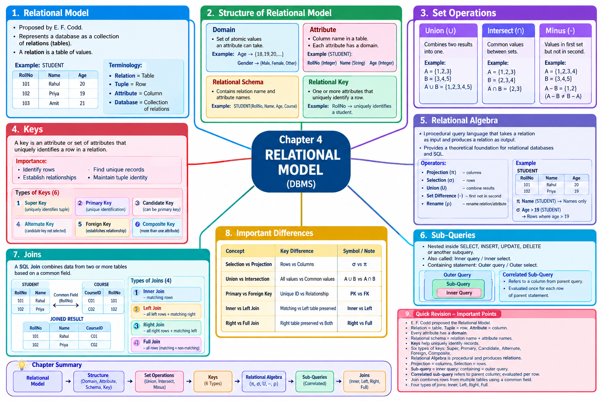

# LJ-DBMS-sem3-chapter4-explained

# DBMS — Chapter 4: RELATIONAL MODEL

I have extracted and reviewed the uploaded **DBMS Chapter 4 PPT**. It contains **11 slides**, covering the Relational Model, Structure, Set Operations, Keys, Relational Algebra, Sub-Queries, and Joins.

We will follow your requested sequence and **not skip any PPT topic**.

# STEP 1 — DEEP EXPLANATION

## 1. Chapter 4 — Relational Model

The main topic of this chapter is the **Relational Model** in DBMS.

According to the PPT, the chapter covers:

```text
RELATIONAL MODEL
│
├── Structure of Relational Model
├── Set Operations
├── Keys
├── Relational Algebra
├── Sub-Queries
└── Joins
```

These concepts are fundamental for understanding how data is represented, identified, queried, and combined in a relational database.

---

# 2. Introduction to Relational Model

### Definition

The **Relational Model** was proposed by **E. F. Codd** to model data in the form of **relations or tables**.

The relational model represents a database as a **collection of relations**.

A relation is essentially a **table containing values**.

### Basic Structure

A relational table consists of:

- **Rows**
    
- **Columns**
    

For example:

```text
STUDENT
+--------+----------+-----+
| RollNo | Name     | Age |
+--------+----------+-----+
| 101    | Rahul    | 20  |
| 102    | Priya    | 19  |
| 103    | Amit     | 21  |
+--------+----------+-----+
```

Here:

- The complete table is a **relation**.
    
- Each row represents a collection of related data values.
    
- Each row is called a **tuple**.
    
- Each column represents an **attribute**.
    

### Important terminology

|Relational Model Term|Meaning|
|---|---|
|Relation|Table|
|Tuple|Row|
|Attribute|Column|
|Database|Collection of relations|

### Real-world example

Consider a college database.

A `STUDENT` relation might contain:

```text
STUDENT
│
├── RollNo
├── Name
├── Course
└── Semester
```

Each student becomes one **tuple**, while `RollNo`, `Name`, `Course`, and `Semester` are **attributes**.

### Exam Point ⭐

> The relational model represents a database as a collection of relations, where each relation is represented as a table.

---

# 3. Structure of Relational Model

The PPT identifies four important concepts in the structure of the relational model:

```text
Structure of Relational Model
│
├── Domain
├── Attribute
├── Relational Schema
└── Relational Key
```

---

## 3.1 Domain

### Definition

A **Domain** contains a set of **atomic values** that an attribute can take.

In simple words, a domain specifies the possible values that can be stored in an attribute.

### Example

Suppose:

```text
Age
```

can contain values such as:

```text
18, 19, 20, 21, 22...
```

These possible values form the domain of the `Age` attribute.

Another example:

```text
Gender → {Male, Female, Other}
```

The domain specifies which values are allowed for the attribute.

### Important Point

The PPT specifically states:

> Domain contains a set of atomic values that an attribute can take.

**Atomic** means the value is treated as a single value rather than a collection that is further divided within the relational model.

---

# 3.2 Attribute

### Definition

An **Attribute** contains the name of a column in a particular table.

For example:

```text
STUDENT
+--------+-------+-----+
| RollNo | Name  | Age |
+--------+-------+-----+
```

The attributes are:

```text
RollNo
Name
Age
```

The PPT also states that each attribute `Ai` must have a **domain**.

Therefore:

```text
Attribute
    ↓
has
    ↓
Domain
```

### Example

For:

```text
STUDENT
```

we can have:

|Attribute|Example Domain|
|---|---|
|RollNo|Integer values|
|Name|Character/String values|
|Age|Integer values|

### Exam Point ⭐

> An attribute represents a column of a relation and each attribute must have a domain.

---

# 3.3 Relational Schema

### Definition

A **Relational Schema** contains the name of the relation and the names of all columns or attributes.

For example:

```text
STUDENT(RollNo, Name, Age, Course)
```

This represents the schema of the `STUDENT` relation.

Here:

```text
STUDENT → Relation name

RollNo
Name
Age
Course
     ↓
Attributes
```

### Example

Suppose we have:

```text
EMPLOYEE(EmpID, Name, Department, Salary)
```

Then:

- `EMPLOYEE` → relation name
    
- `EmpID` → attribute
    
- `Name` → attribute
    
- `Department` → attribute
    
- `Salary` → attribute
    

### Exam Point ⭐

> A relational schema contains the name of the relation and the names of all its attributes.

---

# 3.4 Relational Key

### Definition

A **Relational Key** consists of one or more attributes that can uniquely identify a row in a relation.

For example:

```text
STUDENT
+--------+--------+-----+
| RollNo | Name   | Age |
+--------+--------+-----+
| 101    | Rahul  | 20  |
| 102    | Priya  | 19  |
| 103    | Amit   | 21  |
+--------+--------+-----+
```

Here, `RollNo` can identify each student uniquely.

```text
RollNo
  ↓
Uniquely identifies
  ↓
Student row
```

The PPT states that a relational key can contain **one or more attributes** and can uniquely identify a row in a relation.

---

# 4. Set Operations

The PPT discusses three set operations:

```text
Set Operations
│
├── Union
├── Intersect
└── Minus
```

These operations work with sets of data/results.

---

# 4.1 Union

### Definition

**Union** combines two different results obtained by a query into a single result in the form of a table.

Symbolically:

```text
A ∪ B
```

means the elements belonging to A or B are combined.

### Example

Suppose:

```text
A = {1, 2, 3}

B = {3, 4, 5}
```

Then:

```text
A ∪ B = {1, 2, 3, 4, 5}
```

The common value `3` is not repeated.

### Diagram

```text
       A          B
    ┌───────┐  ┌───────┐
    │ 1  2  │  │ 3  4  │
    │ 3     │  │ 5     │
    └───────┘  └───────┘
          \      /
           \    /
            \  /
             ↓
        ┌───────────┐
        │1 2 3 4 5  │
        └───────────┘
```

### Exam Point ⭐

> Union combines two query results into one result.

---

# 4.2 Intersect

### Definition

The **Intersection** operator gives the common data values between two intersected datasets.

Symbol:

```text
A ∩ B
```

### Example

```text
A = {1, 2, 3}

B = {2, 3, 4}
```

Therefore:

```text
A ∩ B = {2, 3}
```

Because `2` and `3` occur in both sets.

### Diagram

```text
       A             B
    ┌───────┐     ┌───────┐
    │ 1     │     │     4 │
    │   2 3 │─────│ 2 3   │
    └───────┘     └───────┘
          ↓
      Common values
          ↓
         2, 3
```

### Exam Point ⭐

> Intersection returns the common data values between two datasets.

---

# 4.3 Minus

### Definition

The **Minus** operator takes two sets and returns the values that are present in the **first set but not in the second set**.

Symbol:

```text
A - B
```

### Example

```text
A = {1, 2, 3, 4}
B = {3, 4, 5}
```

Therefore:

```text
A - B = {1, 2}
```

Because `1` and `2` are in A but not in B.

### Important Difference

The order matters.

```text
A - B
```

is not generally the same as:

```text
B - A
```

Example:

```text
A - B = {1,2}

B - A = {5}
```

---

# 5. Keys

The PPT gives significant importance to **Keys in DBMS**.

### Definition

A **Key** in DBMS is an attribute or set of attributes that helps identify a row (tuple) in a relation (table).

Keys are useful for:

- Identifying rows.
    
- Finding unique records.
    
- Establishing relationships between tables.
    
- Uniquely identifying a row using one or more columns.
    

### Example

Consider:

```text
STUDENT
+--------+--------+-----+
| RollNo | Name   | Age |
+--------+--------+-----+
| 101    | Rahul  | 20  |
| 102    | Priya  | 19  |
| 103    | Amit   | 21  |
+--------+--------+-----+
```

`RollNo` can uniquely identify each student.

```text
RollNo = 102
       ↓
   Priya's row
```

### Why are keys important?

```text
KEY
 ↓
Unique identification
 ↓
Find a particular record
 ↓
Help establish relationships
 ↓
Maintain identification of tuples
```

---

# 6. Types of Keys in DBMS

The PPT lists the following types:

```text
Types of Keys
│
├── Super Key
├── Primary Key
├── Candidate Key
├── Alternate Key
├── Foreign Key
└── Composite Key
```

These six key types must be covered carefully in the question bank.

---

## 6.1 Super Key

A **Super Key** is an attribute or combination of attributes that can uniquely identify a tuple in a relation.

Example:

```text
STUDENT
+--------+--------+-------+
| RollNo | Name   | Email |
+--------+--------+-------+
| 101    | Rahul  | ...   |
| 102    | Priya  | ...   |
+--------+--------+-------+
```

Possible super keys could include combinations that uniquely identify a student.

The important idea is:

```text
Super Key
    ↓
Uniquely identifies tuple
```

---

## 6.2 Primary Key

A **Primary Key** is used to uniquely identify each row in a table.

Example:

```text
STUDENT
+--------+-------+
| RollNo | Name  |
+--------+-------+
| 101    | Rahul |
| 102    | Priya |
+--------+-------+
```

Here:

```text
RollNo → Primary Key
```

### Exam Point ⭐

A primary key provides a unique identification for records in a table.

---

## 6.3 Candidate Key

A **Candidate Key** is a key that can serve as a candidate for becoming the primary key.

In a table, there can be multiple possible candidate keys.

For example, if both `RollNo` and `Email` uniquely identify students:

```text
Candidate Keys
├── RollNo
└── Email
```

One can be selected as the primary key.

---

## 6.4 Alternate Key

An **Alternate Key** is a candidate key that is **not selected as the primary key**.

Example:

```text
Candidate Keys:
    RollNo
    Email

Selected Primary Key:
    RollNo

Remaining Candidate Key:
    Email
          ↓
    Alternate Key
```

### Easy way to remember

```text
Candidate Keys
      ↓
One selected
      ↓
Primary Key

Others
      ↓
Alternate Keys
```

---

# 6.5 Foreign Key

A **Foreign Key** is used to establish a relationship between tables.

For example:

```text
STUDENT
+--------+--------+
| RollNo | Name   |
+--------+--------+
| 101    | Rahul  |
| 102    | Priya  |
+--------+--------+

COURSE
+----------+--------+
| CourseID | RollNo |
+----------+--------+
| C01      | 101    |
| C02      | 102    |
+----------+--------+
```

Here `RollNo` in the second table can reference the corresponding student.

Conceptually:

```text
Table 1
   │
   │ relationship
   ↓
Table 2
```

### Exam Point ⭐

> Foreign keys are important for finding/representing relationships between tables.

---

# 6.6 Composite Key

A **Composite Key** consists of more than one attribute used together to identify a tuple.

Example:

```text
ENROLLMENT
+---------+----------+-------+
| RollNo  | CourseID | Grade |
+---------+----------+-------+
| 101     | C01      | A     |
| 101     | C02      | B     |
| 102     | C01      | A     |
+---------+----------+-------+
```

Suppose neither `RollNo` nor `CourseID` alone is sufficient to uniquely identify an enrollment.

Together:

```text
(RollNo, CourseID)
```

can uniquely identify a record.

Therefore:

```text
RollNo + CourseID
       ↓
Composite Key
```

---

# 7. Relational Algebra

### Definition

**Relational Algebra** is a **procedural query language** that takes a relation as input and generates a relation as output.

The basic flow is:

```text
Relation
   │
   ↓
Relational Algebra Operator
   │
   ↓
Relation
```

### Important Point

The PPT states that relational algebra provides a **theoretical foundation for relational databases and SQL**.

Therefore:

```text
Relational Algebra
        ↓
Theoretical foundation
        ↓
Relational Databases + SQL
```

---

# 8. Operators in Relational Algebra

The PPT lists the following operators:

```text
Relational Algebra Operators
│
├── Projection (π)
├── Selection (σ)
├── Union (U)
├── Set Difference (-)
└── Rename (ρ)
```

---

# 8.1 Projection (π)

### Symbol

```text
π
```

Projection is used to select required **columns/attributes** from a relation.

Example:

```text
STUDENT
+--------+--------+-----+
| RollNo | Name   | Age |
+--------+--------+-----+
| 101    | Rahul  | 20  |
| 102    | Priya  | 19  |
+--------+--------+-----+
```

If we want only `Name`:

```text
π Name (STUDENT)
```

Result:

```text
+-------+
| Name  |
+-------+
| Rahul |
| Priya |
+-------+
```

### Easy memory trick

```text
Projection → Columns
```

---

# 8.2 Selection (σ)

### Symbol

```text
σ
```

Selection is used to select required **rows** based on a condition.

Example:

```text
STUDENT
+--------+--------+-----+
| RollNo | Name   | Age |
+--------+--------+-----+
| 101    | Rahul  | 20  |
| 102    | Priya  | 19  |
| 103    | Amit   | 21  |
+--------+--------+-----+
```

Suppose we want students whose age is greater than 19:

```text
σ Age > 19 (STUDENT)
```

Result:

```text
+--------+-------+-----+
| RollNo | Name  | Age |
+--------+-------+-----+
| 101    | Rahul | 20  |
| 103    | Amit  | 21  |
+--------+-------+-----+
```

### Easy memory trick

```text
Selection → Rows
Projection → Columns
```

### ⭐ Very Important Difference

|Selection|Projection|
|---|---|
|Selects rows|Selects columns|
|Uses conditions|Specifies attributes|
|Symbol: σ|Symbol: π|

---

# 8.3 Union (U)

The Union operator combines two compatible relations.

```text
A U B
```

It produces a relation containing values from both relations.

This corresponds to the **Union set operation** discussed earlier.

---

# 8.4 Set Difference (-)

Set Difference returns values that belong to the first relation but not the second.

```text
A - B
```

Example:

```text
A = {1,2,3}
B = {2,3,4}

A - B = {1}
```

---

# 8.5 Rename (ρ)

### Symbol

```text
ρ
```

The **Rename** operator is used to rename a relation or its attributes in relational algebra.

Basic idea:

```text
Old Relation Name
       ↓
     ρ
       ↓
New Relation Name
```

This is especially useful when a relation needs to be referred to using another name during query operations.

---

# 9. Sub-Queries

### Definition

A **Sub-Query** is a query that is nested inside:

- A `SELECT` statement
    
- An `INSERT` statement
    
- An `UPDATE` statement
    
- A `DELETE` statement
    
- Another subquery
    

The PPT also states that a subquery is called an:

- **Inner query**
    
- **Inner select**
    

The statement containing the subquery is called:

- **Outer query**
    
- **Outer select**
    

### Basic structure

```text
Outer Query
│
└── Sub-Query
      │
      └── Inner Query
```

For understanding:

```text
Outer Query
      ↓
contains
      ↓
Sub-Query
      ↓
produces result
      ↓
used by Outer Query
```

---

# 9.1 Inner Query and Outer Query

Consider the conceptual structure:

```text
OUTER QUERY
│
│   contains
│
└────── SUB-QUERY
          │
          └── INNER QUERY
```

Therefore:

|Term|Meaning|
|---|---|
|Sub-query|Query nested inside another statement/query|
|Inner query|Another name for sub-query|
|Inner select|Another name for sub-query|
|Outer query|Statement containing the sub-query|
|Outer select|Another name for the statement containing the sub-query|

### Exam Point ⭐

> A sub-query can be nested inside SELECT, INSERT, UPDATE, DELETE, or another subquery.

---

# 10. Correlated Sub-Query

This is an important concept from the PPT.

### Definition

A **Correlated Sub-Query** is a sub-query that refers to a column from a table in the **parent query**.

The PPT states that a correlated sub-query is evaluated **once for each row processed by the parent statement**.

### Basic structure

```text
Parent Query
│
├── Row 1 ──→ Sub-query evaluated
├── Row 2 ──→ Sub-query evaluated
├── Row 3 ──→ Sub-query evaluated
└── Row 4 ──→ Sub-query evaluated
```

Therefore:

```text
Parent Query processes a row
          ↓
Correlated Sub-query executes
          ↓
Next row
          ↓
Correlated Sub-query executes again
```

### Important difference

|Normal Sub-Query|Correlated Sub-Query|
|---|---|
|Nested query|Nested query|
|Does not necessarily refer to parent-row values|Refers to a column from the parent query|
|General nested query concept|Evaluated once for each row processed by parent statement|

### ⭐ Exam Point

> A correlated sub-query refers to a column from the parent query and is evaluated once for each row processed by the parent statement.

---

# 11. Joins

### Definition

A **SQL Join** statement is used to combine data or rows from **two or more tables** based on a **common field** between them.

### Basic concept

Suppose we have:

```text
STUDENT                    COURSE
+--------+-------+         +----------+--------+
| RollNo | Name  |         | CourseID | RollNo |
+--------+-------+         +----------+--------+
| 101    | Rahul |         | C01      | 101    |
| 102    | Priya |         | C02      | 102    |
+--------+-------+         +----------+--------+
```

The common field is:

```text
RollNo
```

A join can combine information from both tables.

```text
STUDENT
   │
   │ Common Field
   ↓
  JOIN
   ↑
   │
COURSE
   │
   ↓
Combined Result
```

---

# 11.1 Types of Joins

The PPT lists four types:

```text
Joins
│
├── Inner Join
├── Left Join
├── Right Join
└── Full Join
```

---

## 11.1.1 Inner Join

An **Inner Join** combines rows from two tables where the joining condition matches.

Conceptually:

```text
Table A        Table B
   │              │
   └──── MATCH ───┘
          ↓
     Inner Join
          ↓
    Matching rows
```

It focuses on matching records between the tables.

---

# 11.1.2 Left Join

A **Left Join** keeps the rows from the **left table** and combines matching rows from the right table.

Conceptually:

```text
LEFT TABLE
    │
    │ + matching rows
    ↓
LEFT JOIN
    ↓
Result
```

The important point to remember is:

> Left Join preserves the rows of the left table.

---

# 11.1.3 Right Join

A **Right Join** keeps the rows from the **right table** and combines matching rows from the left table.

Conceptually:

```text
RIGHT TABLE
    │
    │ + matching rows
    ↓
RIGHT JOIN
    ↓
Result
```

The important point is:

> Right Join preserves the rows of the right table.

---

# 11.1.4 Full Join

A **Full Join** combines the rows from both tables, including matching and non-matching rows.

Conceptually:

```text
LEFT TABLE
    │
    ├──── Matching ────┐
    │                  │
    └──── Non-match    │
                       ↓
                   FULL JOIN
                       ↑
    ┌──── Matching ────┘
    │
RIGHT TABLE
```

### Join comparison

|Join|Main idea|
|---|---|
|Inner Join|Matching rows|
|Left Join|All rows from left + matching right rows|
|Right Join|All rows from right + matching left rows|
|Full Join|Rows from both sides, including non-matching rows|

---

# CHAPTER SUMMARY

The **Relational Model** represents a database as a collection of relations/tables.

The major concepts covered in the PPT are:

```text
Relational Model
│
├── Structure
│   ├── Domain
│   ├── Attribute
│   ├── Relational Schema
│   └── Relational Key
│
├── Set Operations
│   ├── Union
│   ├── Intersect
│   └── Minus
│
├── Keys
│   ├── Super Key
│   ├── Primary Key
│   ├── Candidate Key
│   ├── Alternate Key
│   ├── Foreign Key
│   └── Composite Key
│
├── Relational Algebra
│   ├── Projection
│   ├── Selection
│   ├── Union
│   ├── Set Difference
│   └── Rename
│
├── Sub-Queries
│   └── Correlated Sub-Query
│
└── Joins
    ├── Inner Join
    ├── Left Join
    ├── Right Join
    └── Full Join
```

---

# IMPORTANT DEFINITIONS

1. **Relational Model** — A model proposed by E. F. Codd that represents a database as a collection of relations/tables.
    
2. **Relation** — A table of values in the relational model.
    
3. **Tuple** — A row in a relation.
    
4. **Attribute** — A column name in a particular table.
    
5. **Domain** — A set of atomic values that an attribute can take.
    
6. **Relational Schema** — Contains the relation name and names of its attributes.
    
7. **Relational Key** — One or more attributes that can uniquely identify a row.
    
8. **Key** — An attribute or set of attributes used to identify a row in a relation.
    
9. **Relational Algebra** — A procedural query language that takes relations as input and produces relations as output.
    
10. **Sub-Query** — A query nested inside a SELECT, INSERT, UPDATE, DELETE statement, or another subquery.
    
11. **Correlated Sub-Query** — A subquery that refers to a column from a table in the parent query.
    
12. **Join** — An operation used to combine rows from two or more tables based on a common field.
    

---

# IMPORTANT DIFFERENCES

## Selection vs Projection

|Selection|Projection|
|---|---|
|Selects rows|Selects columns|
|Uses conditions|Selects required attributes|
|Symbol: σ|Symbol: π|

## Union vs Intersection

|Union|Intersection|
|---|---|
|Combines values from both sets|Returns common values|
|A ∪ B|A ∩ B|
|Includes values belonging to either set|Includes values belonging to both|

## Primary Key vs Foreign Key

|Primary Key|Foreign Key|
|---|---|
|Uniquely identifies a row|Helps establish relationship between tables|
|Identifies records in its table|References/relates to data in another table|
|Used for unique identification|Used for relationships|

## Inner vs Left vs Right vs Full Join

|Join|Rows preserved|
|---|---|
|Inner Join|Matching rows|
|Left Join|Left table + matching right rows|
|Right Join|Right table + matching left rows|
|Full Join|Rows from both tables|

---

# IMPORTANT EXAM POINTS ⭐

- **E. F. Codd** proposed the Relational Model.
    
- A **relation is a table**.
    
- A **tuple is a row**.
    
- An **attribute is a column**.
    
- Every attribute has a **domain**.
    
- A relational schema contains the **relation name and attribute names**.
    
- Keys help **uniquely identify records**.
    
- The PPT lists **six types of keys**.
    
- Relational Algebra is a **procedural query language**.
    
- Relational Algebra takes a **relation as input and produces a relation as output**.
    
- **Projection (π)** deals with columns.
    
- **Selection (σ)** deals with rows.
    
- A sub-query is also called an **inner query/inner select**.
    
- A query containing a sub-query is called the **outer query/outer select**.
    
- A correlated sub-query refers to a **column from the parent query**.
    
- A correlated sub-query is evaluated **once for each row processed by the parent statement**.
    
- A Join combines rows from multiple tables using a **common field**.
    
- The PPT lists **Inner, Left, Right, and Full Join**.
    

---

## PPT Coverage Check — Step 1

|PPT Topic|Covered|
|---|--:|
|Chapter 4 — Relational Model|✅|
|Structure of Relational Model|✅|
|Domain|✅|
|Attribute|✅|
|Relational Schema|✅|
|Relational Key|✅|
|Union|✅|
|Intersect|✅|
|Minus|✅|
|Keys|✅|
|Super Key|✅|
|Primary Key|✅|
|Candidate Key|✅|
|Alternate Key|✅|
|Foreign Key|✅|
|Composite Key|✅|
|Relational Algebra|✅|
|Projection|✅|
|Selection|✅|
|Union in Relational Algebra|✅|
|Set Difference|✅|
|Rename|✅|
|Sub-Queries|✅|
|Correlated Sub-Query|✅|
|Joins|✅|
|Inner Join|✅|
|Left Join|✅|
|Right Join|✅|
|Full Join|✅|

**Step 1 — Deep Explanation: COMPLETED.**

When you say **“next”**, I will continue with **STEP 2 — Complete Mind Map**, without restarting.

---
# STEP 2 — COMPLETE MIND MAP

```text
CHAPTER 4 — RELATIONAL MODEL
│
├── 1. Relational Model
│   ├── Proposed by E. F. Codd
│   ├── Database represented as collection of relations
│   ├── Relation → Table
│   ├── Tuple → Row
│   ├── Attribute → Column
│   └── Database → Collection of relations
│
├── 2. Structure of Relational Model
│   ├── Domain
│   │   ├── Set of atomic values
│   │   └── Values an attribute can take
│   │
│   ├── Attribute
│   │   ├── Column name
│   │   └── Each attribute has a domain
│   │
│   ├── Relational Schema
│   │   ├── Relation name
│   │   └── Attribute names
│   │
│   └── Relational Key
│       └── One or more attributes uniquely identifying a row
│
├── 3. Set Operations
│   ├── Union (∪)
│   │   └── Combines two results
│   ├── Intersect (∩)
│   │   └── Gives common values
│   └── Minus (-)
│       └── Values in first set but not second
│
├── 4. Keys
│   ├── Purpose
│   │   ├── Identify rows
│   │   ├── Find unique records
│   │   ├── Establish relationships
│   │   └── Maintain tuple identity
│   │
│   └── Types
│       ├── Super Key
│       ├── Primary Key
│       ├── Candidate Key
│       ├── Alternate Key
│       ├── Foreign Key
│       └── Composite Key
│
├── 5. Relational Algebra
│   ├── Procedural query language
│   ├── Relation → Input
│   ├── Relation → Output
│   ├── Theoretical foundation for relational DBs and SQL
│   │
│   └── Operators
│       ├── Projection (π) → Columns
│       ├── Selection (σ) → Rows
│       ├── Union (∪)
│       ├── Set Difference (-)
│       └── Rename (ρ)
│
├── 6. Sub-Queries
│   ├── Nested inside SELECT
│   ├── Nested inside INSERT
│   ├── Nested inside UPDATE
│   ├── Nested inside DELETE
│   ├── Nested inside another subquery
│   ├── Inner Query
│   ├── Inner Select
│   ├── Outer Query
│   ├── Outer Select
│   │
│   └── Correlated Sub-Query
│       ├── Refers to parent-query column
│       └── Evaluated once for each parent row
│
└── 7. Joins
    ├── Combines rows from two or more tables
    ├── Based on common field
    │
    └── Types
        ├── Inner Join
        │   └── Matching rows
        ├── Left Join
        │   └── All left + matching right
        ├── Right Join
        │   └── All right + matching left
        └── Full Join
            └── Matching + non-matching rows
```

## STEP 3 — MIND MAP IMAGE

The complete visual revision mind map has been created above, including the chapter's major topics, subtopics, six key types, relational algebra operators, subqueries, correlated subqueries, join types, important differences, and quick-revision points.

**STEP 2 — Completed ✅**  
**STEP 3 — Completed ✅**

When you say **“next”**, I will start **STEP 4 — MCQs FIRST**, beginning from **Q1**, and continue until the entire PPT is covered.

---

<p align="center">
	  
	</p>

---

# STEP 4 — MCQs + ANSWERS

## A. Relational Model

**Q1. Who proposed the Relational Model?**

A) Charles Babbage  
B) E. F. Codd  
C) James Gosling  
D) Dennis Ritchie

**Answer: B) E. F. Codd**

---

**Q2. In the Relational Model, data is represented as a collection of ______.**

A) Files  
B) Objects  
C) Relations  
D) Programs

**Answer: C) Relations**

---

**Q3. A relation in a relational database is represented as a ______.**

A) Tree  
B) Table  
C) Graph  
D) File

**Answer: B) Table**

---

**Q4. A tuple in the Relational Model represents a ______.**

A) Column  
B) Database  
C) Row  
D) Domain

**Answer: C) Row**

---

**Q5. An attribute in a relation represents a ______.**

A) Row  
B) Column  
C) Table  
D) Database

**Answer: B) Column**

---

**Q6. Which of the following correctly represents the terminology of the Relational Model?**

A) Tuple → Column  
B) Attribute → Row  
C) Relation → Table  
D) Domain → Database

**Answer: C) Relation → Table**

---

**Q7. A database in the Relational Model is a collection of ______.**

A) Attributes  
B) Relations  
C) Domains  
D) Keys

**Answer: B) Relations**

---

**Q8. Which term represents a row of a relation?**

A) Attribute  
B) Tuple  
C) Domain  
D) Schema

**Answer: B) Tuple**

---

# B. Structure of Relational Model

**Q9. Which of the following is a component of the structure of the Relational Model?**

A) Domain  
B) Attribute  
C) Relational Schema  
D) All of the above

**Answer: D) All of the above**

---

**Q10. A domain contains a set of ______ values.**

A) Composite  
B) Atomic  
C) Duplicate  
D) Random

**Answer: B) Atomic**

---

**Q11. A domain specifies the values that an ______ can take.**

A) Attribute  
B) Database  
C) Relation  
D) Query

**Answer: A) Attribute**

---

**Q12. Which of the following best describes a domain?**

A) A set of atomic values an attribute can take  
B) A collection of tables  
C) A row in a table  
D) A key used to identify records

**Answer: A) A set of atomic values an attribute can take**

---

**Q13. In `STUDENT(RollNo, Name, Age)`, which of the following is an attribute?**

A) STUDENT  
B) RollNo  
C) STUDENT(RollNo)  
D) Table

**Answer: B) RollNo**

---

**Q14. Each attribute in the Relational Model must have a ______.**

A) Tuple  
B) Domain  
C) Query  
D) Join

**Answer: B) Domain**

---

**Q15. A relational schema contains the relation name and the names of its ______.**

A) Rows  
B) Tables  
C) Attributes  
D) Domains only

**Answer: C) Attributes**

---

**Q16. Which is a valid example of a relational schema?**

A) `STUDENT(RollNo, Name, Age)`  
B) `Rahul, 20, CSE`  
C) `101 → Rahul`  
D) `{101,102,103}`

**Answer: A) `STUDENT(RollNo, Name, Age)`**

---

**Q17. A relational key consists of ______ attributes that can uniquely identify a row.**

A) One or more  
B) Exactly one  
C) Zero only  
D) No

**Answer: A) One or more**

---

**Q18. The main purpose of a relational key is to ______.**

A) Store duplicate values  
B) Uniquely identify a row  
C) Delete a table  
D) Rename a database

**Answer: B) Uniquely identify a row**

---

# C. Set Operations

**Q19. Which set operation combines two different results into one result?**

A) Minus  
B) Intersect  
C) Union  
D) Rename

**Answer: C) Union**

---

**Q20. What is the symbol for Union?**

A) ∩  
B) ∪  
C) −  
D) π

**Answer: B) ∪**

---

**Q21. If A = {1,2,3} and B = {3,4,5}, what is A ∪ B?**

A) {3}  
B) {1,2}  
C) {1,2,3,4,5}  
D) {4,5}

**Answer: C) {1,2,3,4,5}**

---

**Q22. Which set operation returns common values between two sets?**

A) Union  
B) Intersect  
C) Minus  
D) Rename

**Answer: B) Intersect**

---

**Q23. What is the symbol for Intersection?**

A) ∪  
B) π  
C) ∩  
D) σ

**Answer: C) ∩**

---

**Q24. If A = {1,2,3} and B = {2,3,4}, then A ∩ B is:**

A) {1,4}  
B) {1,2,3,4}  
C) {2,3}  
D) {1,2}

**Answer: C) {2,3}**

---

**Q25. The Minus operation A − B returns:**

A) Values in B but not A  
B) Values common to A and B  
C) Values in A but not B  
D) All values in A and B

**Answer: C) Values in A but not B**

---

**Q26. If A = {1,2,3,4} and B = {3,4,5}, then A − B is:**

A) {3,4}  
B) {1,2}  
C) {5}  
D) {1,2,3,4,5}

**Answer: B) {1,2}**

---

**Q27. Which set operation is order-sensitive?**

A) Union  
B) Intersection  
C) Minus  
D) None

**Answer: C) Minus**

---

**Q28. Which operation gives only the elements common to both datasets?**

A) A ∪ B  
B) A ∩ B  
C) A − B  
D) B − A

**Answer: B) A ∩ B**

---

# D. Keys

**Q29. A key in DBMS is an attribute or set of attributes used to ______.**

A) Uniquely identify a row  
B) Create duplicate rows  
C) Delete a database  
D) Rename a table

**Answer: A) Uniquely identify a row**

---

**Q30. Which of the following is NOT one of the six key types covered in the PPT?**

A) Super Key  
B) Primary Key  
C) Candidate Key  
D) Sorting Key

**Answer: D) Sorting Key**

---

**Q31. Which key can uniquely identify a tuple in a relation?**

A) Super Key  
B) Foreign Key only  
C) Alternate Key only  
D) None

**Answer: A) Super Key**

---

**Q32. A Super Key can contain:**

A) Only one attribute  
B) One or more attributes  
C) No attributes  
D) Only foreign attributes

**Answer: B) One or more attributes**

---

**Q33. Which key is used for unique identification of records in a table?**

A) Primary Key  
B) Foreign Key  
C) Alternate Key  
D) Composite Key only

**Answer: A) Primary Key**

---

**Q34. A Candidate Key is a key that can serve as a candidate for becoming the:**

A) Foreign key  
B) Primary key  
C) Composite key  
D) Domain

**Answer: B) Primary key**

---

**Q35. If several Candidate Keys exist, the one selected to uniquely identify records is the:**

A) Foreign Key  
B) Alternate Key  
C) Primary Key  
D) Super Key only

**Answer: C) Primary Key**

---

**Q36. A Candidate Key that is not selected as the Primary Key is called an:**

A) Foreign Key  
B) Alternate Key  
C) Composite Key  
D) Domain Key

**Answer: B) Alternate Key**

---

**Q37. Which key is mainly associated with establishing relationships between tables?**

A) Primary Key  
B) Foreign Key  
C) Alternate Key  
D) Super Key

**Answer: B) Foreign Key**

---

**Q38. A Composite Key contains:**

A) No attributes  
B) Exactly one attribute  
C) More than one attribute  
D) Only foreign attributes

**Answer: C) More than one attribute**

---

**Q39. Which key can consist of a combination of attributes?**

A) Composite Key  
B) Domain  
C) Tuple  
D) Schema

**Answer: A) Composite Key**

---

**Q40. Consider `(RollNo, CourseID)` being used together to uniquely identify an enrollment. This is an example of a:**

A) Foreign Key  
B) Composite Key  
C) Alternate Key  
D) Domain

**Answer: B) Composite Key**

---

**Q41. Which key helps find unique records?**

A) Key  
B) Domain  
C) Tuple  
D) Schema

**Answer: A) Key**

---

**Q42. Which of the following is a purpose of keys according to the chapter?**

A) Identify rows  
B) Find unique records  
C) Establish relationships  
D) All of the above

**Answer: D) All of the above**

---

**Q43. Suppose `RollNo` and `Email` can both uniquely identify students. If `RollNo` is selected as the Primary Key, `Email` becomes an:**

A) Foreign Key  
B) Alternate Key  
C) Composite Key  
D) Domain

**Answer: B) Alternate Key**

---

# E. Relational Algebra

**Q44. Relational Algebra is a ______ query language.**

A) Procedural  
B) Natural  
C) Object-oriented  
D) Assembly

**Answer: A) Procedural**

---

**Q45. Relational Algebra takes a ______ as input.**

A) String  
B) Relation  
C) Program  
D) Database server

**Answer: B) Relation**

---

**Q46. Relational Algebra produces a ______ as output.**

A) Relation  
B) File system  
C) Program  
D) Domain only

**Answer: A) Relation**

---

**Q47. Relational Algebra provides a theoretical foundation for:**

A) Relational databases and SQL  
B) Operating systems only  
C) Computer networks only  
D) Hardware design

**Answer: A) Relational databases and SQL**

---

**Q48. Which symbol represents Projection?**

A) σ  
B) π  
C) ρ  
D) ∩

**Answer: B) π**

---

**Q49. Projection is used to select:**

A) Rows  
B) Columns  
C) Tables only  
D) Databases

**Answer: B) Columns**

---

**Q50. Which symbol represents Selection?**

A) π  
B) σ  
C) ρ  
D) ∪

**Answer: B) σ**

---

**Q51. Selection is primarily used to select:**

A) Columns  
B) Rows  
C) Tables  
D) Schemas

**Answer: B) Rows**

---

**Q52. Which statement is correct?**

A) Projection → Rows  
B) Selection → Columns  
C) Projection → Columns  
D) Both select only tables

**Answer: C) Projection → Columns**

---

**Q53. Which relational algebra operator is used to rename a relation or attributes?**

A) Selection  
B) Projection  
C) Rename  
D) Union

**Answer: C) Rename**

---

**Q54. What is the symbol for Rename?**

A) ρ  
B) π  
C) σ  
D) ∪

**Answer: A) ρ**

---

**Q55. Which of the following is NOT listed as a relational algebra operator in the PPT?**

A) Projection  
B) Selection  
C) Rename  
D) Sorting

**Answer: D) Sorting**

---

**Q56. Which relational algebra operator corresponds to combining compatible results?**

A) Union  
B) Selection  
C) Rename  
D) Projection

**Answer: A) Union**

---

**Q57. Which operator corresponds to the difference between two relations?**

A) Projection  
B) Set Difference  
C) Rename  
D) Selection

**Answer: B) Set Difference**

---

# F. Sub-Queries

**Q58. A sub-query is a query that is ______ inside another statement or query.**

A) Deleted  
B) Nested  
C) Sorted  
D) Renamed

**Answer: B) Nested**

---

**Q59. A sub-query can be nested inside which statement?**

A) SELECT  
B) INSERT  
C) UPDATE  
D) All of the above

**Answer: D) All of the above**

---

**Q60. According to the PPT, a sub-query can also be nested inside:**

A) Another subquery  
B) Only a table  
C) Only a domain  
D) Only a key

**Answer: A) Another subquery**

---

**Q61. A sub-query is also called an:**

A) Outer query  
B) Inner query  
C) Main query  
D) Parent table

**Answer: B) Inner query**

---

**Q62. Another name for a sub-query is:**

A) Inner select  
B) Outer select  
C) Primary select  
D) Foreign select

**Answer: A) Inner select**

---

**Q63. The statement containing a sub-query is called the:**

A) Inner query  
B) Outer query  
C) Candidate query  
D) Domain query

**Answer: B) Outer query**

---

**Q64. Another name for the statement containing a sub-query is:**

A) Outer select  
B) Inner select  
C) Foreign select  
D) Composite select

**Answer: A) Outer select**

---

# G. Correlated Sub-Queries

**Q65. A correlated sub-query refers to a column from the ______.**

A) Domain  
B) Parent query  
C) Database name  
D) Schema only

**Answer: B) Parent query**

---

**Q66. A correlated sub-query is evaluated:**

A) Only once for the entire database  
B) Once for each row processed by the parent statement  
C) Before the parent query only  
D) Never

**Answer: B) Once for each row processed by the parent statement**

---

**Q67. Which statement correctly describes a correlated sub-query?**

A) It never refers to the parent query  
B) It refers to a column from the parent query  
C) It only works with keys  
D) It is the same as a relational schema

**Answer: B) It refers to a column from the parent query**

---

**Q68. Suppose the parent query processes 10 rows. According to the PPT's description, a correlated sub-query is evaluated:**

A) 1 time  
B) 2 times  
C) 5 times  
D) Once for each processed row

**Answer: D) Once for each processed row**

---

**Q69. Which is a key characteristic of a correlated sub-query?**

A) It depends on values from the parent query  
B) It creates a new database  
C) It removes all rows  
D) It changes a domain

**Answer: A) It depends on values from the parent query**

---

# H. Joins

**Q70. A SQL Join is used to combine data or rows from:**

A) Only one table  
B) Two or more tables  
C) Only databases  
D) Only domains

**Answer: B) Two or more tables**

---

**Q71. A Join generally combines tables based on a:**

A) Random value  
B) Common field  
C) Domain name only  
D) Database password

**Answer: B) Common field**

---

**Q72. Which of the following is NOT one of the four Join types listed in the PPT?**

A) Inner Join  
B) Left Join  
C) Right Join  
D) Cross Join

**Answer: D) Cross Join**

---

**Q73. Which Join focuses on matching rows between two tables?**

A) Inner Join  
B) Left Join  
C) Right Join  
D) Full Join

**Answer: A) Inner Join**

---

**Q74. Which Join preserves all rows from the left table and matching rows from the right table?**

A) Inner Join  
B) Left Join  
C) Right Join  
D) Full Join

**Answer: B) Left Join**

---

**Q75. Which Join preserves all rows from the right table and matching rows from the left table?**

A) Left Join  
B) Inner Join  
C) Right Join  
D) Full Join

**Answer: C) Right Join**

---

**Q76. Which Join includes matching and non-matching rows from both tables?**

A) Inner Join  
B) Left Join  
C) Right Join  
D) Full Join

**Answer: D) Full Join**

---

**Q77. If the requirement is to retain every row of the left table, which Join should be considered?**

A) Left Join  
B) Right Join  
C) Inner Join  
D) Full Join only

**Answer: A) Left Join**

---

**Q78. If the requirement is to retain every row of the right table, which Join should be considered?**

A) Inner Join  
B) Left Join  
C) Right Join  
D) None

**Answer: C) Right Join**

---

**Q79. Which Join returns matching rows only according to the joining condition?**

A) Inner Join  
B) Full Join  
C) Left Join  
D) Right Join

**Answer: A) Inner Join**

---

**Q80. Which Join provides rows from both sides, including non-matching rows?**

A) Inner Join  
B) Full Join  
C) Left Join only  
D) Right Join only

**Answer: B) Full Join**

---

# I. Mixed Concept & Exam-Oriented MCQs

**Q81. Which pair is correctly matched?**

A) Tuple — Column  
B) Attribute — Row  
C) Relation — Table  
D) Domain — Table

**Answer: C) Relation — Table**

---

**Q82. Which pair is correctly matched?**

A) Projection — Rows  
B) Selection — Columns  
C) Projection — Columns  
D) Rename — Rows

**Answer: C) Projection — Columns**

---

**Q83. Which pair is correctly matched?**

A) σ — Projection  
B) π — Selection  
C) ρ — Rename  
D) ∩ — Union

**Answer: C) ρ — Rename**

---

**Q84. Which pair is correctly matched?**

A) ∪ — Union  
B) ∩ — Minus  
C) π — Selection  
D) σ — Rename

**Answer: A) ∪ — Union**

---

**Q85. Which pair is correctly matched?**

A) Primary Key — Combines two tables  
B) Foreign Key — Helps establish relationships  
C) Domain — Identifies every row  
D) Tuple — Attribute domain

**Answer: B) Foreign Key — Helps establish relationships**

---

**Q86. Which sequence correctly represents the relationship between a correlated sub-query and its parent query?**

A) Sub-query → Parent row → Database  
B) Parent row → Correlated sub-query evaluation  
C) Domain → Key → Sub-query  
D) Attribute → Schema → Join

**Answer: B) Parent row → Correlated sub-query evaluation**

---

**Q87. Which sequence correctly represents relational algebra?**

A) Relation → Operator → Relation  
B) Operator → Database → File  
C) Tuple → Domain → Database  
D) Table → Hardware → Relation

**Answer: A) Relation → Operator → Relation**

---

**Q88. A student wants only the `Name` column from a `STUDENT` relation. Which relational algebra operation should be used?**

A) Selection  
B) Projection  
C) Rename  
D) Set Difference

**Answer: B) Projection**

---

**Q89. A student wants only students satisfying `Age > 19`. Which relational algebra operation should be used?**

A) Projection  
B) Selection  
C) Rename  
D) Union

**Answer: B) Selection**

---

**Q90. A student wants to combine the results of two compatible relations. Which operation is appropriate?**

A) Union  
B) Selection  
C) Projection  
D) Rename

**Answer: A) Union**

---

**Q91. A student wants values that occur in both relations. Which operation should be used?**

A) Minus  
B) Union  
C) Intersection  
D) Projection

**Answer: C) Intersection**

---

**Q92. A student wants values present in relation A but absent from relation B. Which operation should be used?**

A) A ∪ B  
B) A ∩ B  
C) A − B  
D) B − A

**Answer: C) A − B**

---

**Q93. Which key would be most appropriate when two attributes together uniquely identify a record?**

A) Composite Key  
B) Alternate Key  
C) Domain  
D) Tuple

**Answer: A) Composite Key**

---

**Q94. Which key is selected from candidate keys to uniquely identify records?**

A) Foreign Key  
B) Primary Key  
C) Alternate Key  
D) Domain

**Answer: B) Primary Key**

---

**Q95. Which key remains when a Candidate Key is not selected as the Primary Key?**

A) Foreign Key  
B) Alternate Key  
C) Composite Key  
D) Super Key

**Answer: B) Alternate Key**

---

**Q96. Which concept specifically involves a column from the parent query?**

A) Projection  
B) Correlated Sub-Query  
C) Union  
D) Full Join

**Answer: B) Correlated Sub-Query**

---

**Q97. Which Join would be appropriate when all rows from the first/left table must be retained?**

A) Right Join  
B) Inner Join  
C) Left Join  
D) Full Join

**Answer: C) Left Join**

---

**Q98. Which Join would be appropriate when all rows from the second/right table must be retained?**

A) Right Join  
B) Inner Join  
C) Left Join  
D) Projection

**Answer: A) Right Join**

---

**Q99. Which Join includes both matching and non-matching records from both tables?**

A) Inner Join  
B) Left Join  
C) Right Join  
D) Full Join

**Answer: D) Full Join**

---

**Q100. Which statement correctly summarizes the chapter?**

A) Relational Model → Tables → Keys → Relational Algebra → Sub-Queries → Joins  
B) Relational Model → Operating System → Compiler → Network  
C) Relational Model → Hardware → Memory → CPU  
D) Relational Model → HTML → CSS → JavaScript

**Answer: A) Relational Model → Tables → Keys → Relational Algebra → Sub-Queries → Joins**

---

# MCQ COVERAGE CHECK

|PPT Topic|MCQs Covered|
|---|--:|
|Relational Model|✅|
|E. F. Codd|✅|
|Relation / Table|✅|
|Tuple / Row|✅|
|Attribute / Column|✅|
|Structure of Relational Model|✅|
|Domain|✅|
|Relational Schema|✅|
|Relational Key|✅|
|Union|✅|
|Intersection|✅|
|Minus|✅|
|Keys|✅|
|Super Key|✅|
|Primary Key|✅|
|Candidate Key|✅|
|Alternate Key|✅|
|Foreign Key|✅|
|Composite Key|✅|
|Relational Algebra|✅|
|Projection|✅|
|Selection|✅|
|Union in Relational Algebra|✅|
|Set Difference|✅|
|Rename|✅|
|Sub-Queries|✅|
|Inner Query / Inner Select|✅|
|Outer Query / Outer Select|✅|
|Correlated Sub-Query|✅|
|Joins|✅|
|Inner Join|✅|
|Left Join|✅|
|Right Join|✅|
|Full Join|✅|

### **MCQs completed: 100**

**MCQ coverage check: No major PPT topic is left uncovered. ✅**

We have **NOT** started the 1-mark section yet.

When you say **“next”**, I will continue with:

# STEP 5 — 1-MARK QUESTIONS

with the answer immediately after every question, and I will separately check for any missing 1-mark topic before moving to 2 marks.

---

# STEP 5 — 1-MARK QUESTIONS

Below is the **complete 1-mark question bank based strictly on the uploaded Chapter 4 PPT**. I have covered the syllabus, definitions, terminology, direct facts, operators, symbols, key types, subqueries, correlated subqueries, and joins.

---

## A. Relational Model — 1 Mark

**Q1. What is the main topic of Chapter 4?**

**Answer:** **Relational Model**.

---

**Q2. Who proposed the Relational Model?**

**Answer:** **E. F. Codd**.

---

**Q3. Why was the Relational Model proposed?**

**Answer:** It was proposed by **E. F. Codd to model data in the form of relations or tables**.

---

**Q4. How does the Relational Model represent a database?**

**Answer:** It represents a database as a **collection of relations**.

---

**Q5. What is a relation?**

**Answer:** A relation is a **table of values**.

---

**Q6. What does every row in a relational table represent?**

**Answer:** Every row represents a **collection of related data values**.

---

**Q7. What can rows in a relational table denote?**

**Answer:** Rows can denote a **real-world entity or relationship**.

---

**Q8. How can the Relational Model be represented?**

**Answer:** It can be represented as a **table with columns and rows**.

---

**Q9. What is a tuple?**

**Answer:** A **tuple is a row** in a relational table.

---

**Q10. What is an attribute?**

**Answer:** An **attribute is the name of a column** in a particular table.

---

**Q11. What is the relationship between a relation and a table?**

**Answer:** A **relation is a table of values**.

---

**Q12. What is the relationship between a tuple and a row?**

**Answer:** A **tuple represents a row**.

---

**Q13. What is the relationship between an attribute and a column?**

**Answer:** An **attribute represents the name of a column**.

---

## B. Structure of Relational Model — 1 Mark

**Q14. Name the main concepts in the Structure of Relational Model given in the PPT.**

**Answer:**

1. Domain
    
2. Attribute
    
3. Relational Schema
    
4. Relational Key
    

---

**Q15. What is a domain?**

**Answer:** A **domain contains a set of atomic values that an attribute can take**.

---

**Q16. What type of values does a domain contain?**

**Answer:** A domain contains **atomic values**.

---

**Q17. What does a domain specify?**

**Answer:** It specifies the **set of values that an attribute can take**.

---

**Q18. What is an attribute according to the PPT?**

**Answer:** An attribute contains the **name of a column in a particular table**.

---

**Q19. Must every attribute have a domain?**

**Answer:** **Yes. Each attribute Ai must have a domain.**

---

**Q20. What is a relational schema?**

**Answer:** A relational schema contains the **name of the relation and the names of all columns or attributes**.

---

**Q21. What does a relational schema contain?**

**Answer:** It contains the **relation name and names of all columns or attributes**.

---

**Q22. What is a relational key?**

**Answer:** A relational key consists of **one or more attributes that can identify a row in a relation uniquely**.

---

**Q23. How many attributes can a relational key contain?**

**Answer:** A relational key can contain **one or more attributes**.

---

**Q24. What is the purpose of a relational key?**

**Answer:** It can **uniquely identify a row in a relation**.

---

**Q25. Which structure concept deals with atomic values?**

**Answer:** **Domain**.

---

**Q26. Which structure concept deals with the name of a column?**

**Answer:** **Attribute**.

---

**Q27. Which structure concept contains the relation name and attribute names?**

**Answer:** **Relational Schema**.

---

**Q28. Which structure concept uniquely identifies a row?**

**Answer:** **Relational Key**.

---

## C. Set Operations — 1 Mark

**Q29. Name the set operations given in the PPT.**

**Answer:**

1. **Union**
    
2. **Intersect**
    
3. **Minus**
    

---

**Q30. What is Union?**

**Answer:** **Union combines two different results obtained by a query into a single result in the form of a table.**

---

**Q31. What is the purpose of Union?**

**Answer:** It combines **two different query results into a single result**.

---

**Q32. What does the Union operation produce?**

**Answer:** It produces a **single result in the form of a table**.

---

**Q33. What is Intersection/Intersect?**

**Answer:** The **intersection operator gives the common data values between two intersected data sets**.

---

**Q34. What does the Intersect operation return?**

**Answer:** It returns the **common data values** between two data sets.

---

**Q35. What is the Minus operation?**

**Answer:** The Minus operator takes two sets and returns the **values that are in the first set but not the second set**.

---

**Q36. Which operation returns common data values?**

**Answer:** **Intersect**.

---

**Q37. Which operation combines two query results into one result?**

**Answer:** **Union**.

---

**Q38. Which operation returns values present in the first set but not the second?**

**Answer:** **Minus**.

---

**Q39. Does the order matter in the Minus operation?**

**Answer:** **Yes.** The operation returns values from the first set that are not present in the second set.

---

## D. Keys — 1 Mark

**Q40. What is a key in DBMS?**

**Answer:** A key is an **attribute or set of attributes that helps identify a row (tuple) in a relation (table)**.

---

**Q41. What is another purpose of keys according to the PPT?**

**Answer:** Keys help **find the relation between two tables**.

---

**Q42. How do keys uniquely identify a row?**

**Answer:** They uniquely identify a row by using a **combination of one or more columns in that table**.

---

**Q43. How are keys useful for finding records?**

**Answer:** Keys are helpful for finding a **unique record or row from a table**.

---

**Q44. What are keys useful for besides identifying rows?**

**Answer:** They are useful for **finding relationships between two tables**.

---

**Q45. What is the main purpose of a database key?**

**Answer:** It helps in **finding a unique record or row from a table**.

---

**Q46. How many types of keys are listed in the PPT?**

**Answer:** **Six types**.

---

**Q47. Name all types of keys given in the PPT.**

**Answer:**

1. Super Key
    
2. Primary Key
    
3. Candidate Key
    
4. Alternate Key
    
5. Foreign Key
    
6. Composite Key
    

---

### Key Types — Direct Questions

**Q48. What is a Super Key?**

**Answer:** A **Super Key** is a key type used to identify a row uniquely.

---

**Q49. What is a Primary Key?**

**Answer:** A **Primary Key** is a key type used for unique identification of records/rows.

---

**Q50. What is a Candidate Key?**

**Answer:** A **Candidate Key** is one of the key types listed in the PPT that can serve as a candidate for uniquely identifying records.

---

**Q51. What is an Alternate Key?**

**Answer:** An **Alternate Key** is one of the key types listed in the PPT.

---

**Q52. What is a Foreign Key?**

**Answer:** A **Foreign Key** is a key type used in relational databases to help represent relationships between tables.

---

**Q53. What is a Composite Key?**

**Answer:** A **Composite Key** is a key type involving a combination of attributes.

---

**Q54. Which key type is associated with uniquely identifying a row using attributes?**

**Answer:** **Super Key**.

---

**Q55. Which key type is associated with a unique record/row identification?**

**Answer:** **Primary Key**.

---

**Q56. Which key type helps establish/find relationships between tables?**

**Answer:** **Foreign Key**.

---

**Q57. Which key type involves multiple attributes together?**

**Answer:** **Composite Key**.

---

## E. Relational Algebra — 1 Mark

**Q58. What is Relational Algebra?**

**Answer:** Relational Algebra is a **procedural query language that takes a relation as input and generates a relation as output**.

---

**Q59. What type of query language is Relational Algebra?**

**Answer:** **Procedural query language**.

---

**Q60. What does Relational Algebra take as input?**

**Answer:** A **relation**.

---

**Q61. What does Relational Algebra generate as output?**

**Answer:** A **relation**.

---

**Q62. What is the theoretical importance of Relational Algebra?**

**Answer:** It provides the **theoretical foundation for relational databases and SQL**.

---

**Q63. What does Relational Algebra mainly provide?**

**Answer:** It mainly provides a **theoretical foundation for relational databases and SQL**.

---

**Q64. Name the operators in Relational Algebra given in the PPT.**

**Answer:**

1. Projection
    
2. Selection
    
3. Union
    
4. Set Difference
    
5. Rename
    

---

**Q65. What is the symbol for Projection?**

**Answer:** **π**

---

**Q66. What is the symbol for Selection?**

**Answer:** **σ**

---

**Q67. What is the symbol for Rename?**

**Answer:** **ρ**

---

**Q68. Which operator is represented by π?**

**Answer:** **Projection**.

---

**Q69. Which operator is represented by σ?**

**Answer:** **Selection**.

---

**Q70. Which operator is represented by ρ?**

**Answer:** **Rename**.

---

**Q71. Which operator combines relations using Union?**

**Answer:** **Union**.

---

**Q72. Which operator represents difference between sets/relations?**

**Answer:** **Set Difference**.

---

**Q73. What is the symbol given for Set Difference?**

**Answer:** **−**

---

**Q74. What symbol is shown for Union in the Relational Algebra section?**

**Answer:** **U**

---

## F. Sub-Queries — 1 Mark

**Q75. What is a Sub-Query?**

**Answer:** A **Sub-Query is a query nested inside a SELECT, INSERT, UPDATE, or DELETE statement, or inside another subquery**.

---

**Q76. Where can a Sub-Query be nested?**

**Answer:** It can be nested inside:

- SELECT
    
- INSERT
    
- UPDATE
    
- DELETE
    
- Another subquery
    

---

**Q77. What is another name for a Sub-Query?**

**Answer:** **Inner Query** or **Inner Select**.

---

**Q78. What is an Inner Query?**

**Answer:** An **Inner Query is another name for a Sub-Query**.

---

**Q79. What is an Inner Select?**

**Answer:** An **Inner Select is another name for a Sub-Query**.

---

**Q80. What is an Outer Query?**

**Answer:** The **statement containing a subquery** is called the Outer Query.

---

**Q81. What is an Outer Select?**

**Answer:** The **statement containing a subquery** is also called the Outer Select.

---

**Q82. What is a Correlated Sub-Query?**

**Answer:** A **Sub-Query that refers to a column from a table in the parent query is called a Correlated Sub-Query**.

---

**Q83. What does a Correlated Sub-Query refer to?**

**Answer:** It refers to a **column from a table in the parent query**.

---

**Q84. How often is a correlated sub-query evaluated?**

**Answer:** It is evaluated **once for each row processed by the parent statement**.

---

**Q85. What is the parent statement in a correlated sub-query?**

**Answer:** It is the **statement containing the correlated sub-query**.

---

**Q86. Which type of sub-query is evaluated once for each row processed by the parent statement?**

**Answer:** **Correlated Sub-Query**.

---

**Q87. Which type of sub-query refers to a column from the parent query?**

**Answer:** **Correlated Sub-Query**.

---

## G. Joins — 1 Mark

**Q88. What is a SQL Join?**

**Answer:** A SQL Join statement is used to **combine data or rows from two or more tables based on a common field between them**.

---

**Q89. What is the main purpose of a Join?**

**Answer:** To **combine data or rows from two or more tables**.

---

**Q90. On what basis are tables joined?**

**Answer:** They are joined based on a **common field**.

---

**Q91. How many Join types are listed in the PPT?**

**Answer:** **Four**.

---

**Q92. Name the four types of Joins given in the PPT.**

**Answer:**

1. Inner Join
    
2. Left Join
    
3. Right Join
    
4. Full Join
    

---

**Q93. What is an Inner Join?**

**Answer:** **Inner Join** is one of the Join types used to combine data from tables based on a common field.

---

**Q94. What is a Left Join?**

**Answer:** **Left Join** is one of the Join types used to combine data from tables based on a common field.

---

**Q95. What is a Right Join?**

**Answer:** **Right Join** is one of the Join types used to combine data from tables based on a common field.

---

**Q96. What is a Full Join?**

**Answer:** **Full Join** is one of the Join types used to combine data from tables based on a common field.

---

**Q97. Which Join type is listed first in the PPT?**

**Answer:** **Inner Join**.

---

**Q98. Which Join type is listed second?**

**Answer:** **Left Join**.

---

**Q99. Which Join type is listed third?**

**Answer:** **Right Join**.

---

**Q100. Which Join type is listed fourth?**

**Answer:** **Full Join**.

---

# H. Direct Concept Identification — 1 Mark

**Q101. Which Relational Model concept represents a row?**

**Answer:** **Tuple**.

---

**Q102. Which Relational Model concept represents a column name?**

**Answer:** **Attribute**.

---

**Q103. Which concept contains a set of atomic values?**

**Answer:** **Domain**.

---

**Q104. Which concept contains the relation name and names of all columns?**

**Answer:** **Relational Schema**.

---

**Q105. Which concept can uniquely identify a row in a relation?**

**Answer:** **Relational Key**.

---

**Q106. Which set operation combines two query results?**

**Answer:** **Union**.

---

**Q107. Which set operation gives common data values?**

**Answer:** **Intersect**.

---

**Q108. Which set operation returns values in the first set but not the second?**

**Answer:** **Minus**.

---

**Q109. Which key helps identify a row in a relation/table?**

**Answer:** **Key**.

---

**Q110. Which key type is listed as the first type in the PPT?**

**Answer:** **Super Key**.

---

**Q111. Which key type is listed immediately after Super Key?**

**Answer:** **Primary Key**.

---

**Q112. Which key type is listed immediately after Primary Key?**

**Answer:** **Candidate Key**.

---

**Q113. Which key type is listed immediately after Candidate Key?**

**Answer:** **Alternate Key**.

---

**Q114. Which key type is listed immediately after Alternate Key?**

**Answer:** **Foreign Key**.

---

**Q115. Which key type is listed last?**

**Answer:** **Composite Key**.

---

**Q116. Which Relational Algebra operator is represented by π?**

**Answer:** **Projection**.

---

**Q117. Which Relational Algebra operator is represented by σ?**

**Answer:** **Selection**.

---

**Q118. Which Relational Algebra operator is represented by ρ?**

**Answer:** **Rename**.

---

**Q119. Which type of query is Relational Algebra?**

**Answer:** **Procedural query language**.

---

**Q120. Which type of query refers to a column from the parent query?**

**Answer:** **Correlated Sub-Query**.

---

**Q121. Which query is also called an Inner Query?**

**Answer:** **Sub-Query**.

---

**Q122. Which statement is also called an Outer Query?**

**Answer:** The **statement containing a subquery**.

---

**Q123. Which SQL operation combines rows from two or more tables?**

**Answer:** **Join**.

---

**Q124. What field is used as the basis for a SQL Join according to the PPT?**

**Answer:** A **common field**.

---

# I. Complete-the-Statement — 1 Mark

**Q125. The Relational Model was proposed by ______.**

**Answer:** **E. F. Codd**

---

**Q126. The Relational Model represents a database as a collection of ______.**

**Answer:** **relations**

---

**Q127. A relation is a ______ of values.**

**Answer:** **table**

---

**Q128. Each row in a relational table is known as a ______.**

**Answer:** **tuple**

---

**Q129. The name of a column in a particular table is called an ______.**

**Answer:** **attribute**

---

**Q130. A domain contains a set of ______ values.**

**Answer:** **atomic**

---

**Q131. Each attribute Ai must have a ______.**

**Answer:** **domain**

---

**Q132. A relational schema contains the name of the ______ and the names of all columns or attributes.**

**Answer:** **relation**

---

**Q133. A relational key can identify a row in a relation ______.**

**Answer:** **uniquely**

---

**Q134. ______ combines two different query results into a single result.**

**Answer:** **Union**

---

**Q135. ______ gives the common data values between two data sets.**

**Answer:** **Intersection / Intersect**

---

**Q136. The Minus operator returns values that are in the ______ set but not the second set.**

**Answer:** **first**

---

**Q137. Relational Algebra is a ______ query language.**

**Answer:** **procedural**

---

**Q138. Relational Algebra takes a ______ as input.**

**Answer:** **relation**

---

**Q139. Relational Algebra generates a ______ as output.**

**Answer:** **relation**

---

**Q140. Relational Algebra provides a theoretical foundation for relational databases and ______.**

**Answer:** **SQL**

---

**Q141. The symbol π represents ______.**

**Answer:** **Projection**

---

**Q142. The symbol σ represents ______.**

**Answer:** **Selection**

---

**Q143. The symbol ρ represents ______.**

**Answer:** **Rename**

---

**Q144. A Sub-Query is also called an ______ query.**

**Answer:** **inner**

---

**Q145. The statement containing a subquery is called an ______ query.**

**Answer:** **outer**

---

**Q146. A correlated Sub-Query refers to a column from a table in the ______ query.**

**Answer:** **parent**

---

**Q147. A correlated Sub-Query is evaluated once for each ______ processed by the parent statement.**

**Answer:** **row**

---

**Q148. A SQL Join combines data or rows from ______ or more tables.**

**Answer:** **two**

---

**Q149. SQL Join is based on a ______ field between tables.**

**Answer:** **common**

---

# J. Important PPT Fact Questions — 1 Mark

**Q150. What is the complete syllabus listed on the Chapter 4 introduction slide?**

**Answer:**  
**Structure of Relational Model, Set Operations, Keys, Relational Algebra, Sub-Queries, and Joins.**

---

**Q151. What does the Relational Model model data in the form of?**

**Answer:** **Relations or tables**.

---

**Q152. What does each row represent in a relational table?**

**Answer:** A **collection of related data values**.

---

**Q153. What can a row denote according to the PPT?**

**Answer:** A **real-world entity or relationship**.

---

**Q154. What does each attribute Ai need to have?**

**Answer:** A **domain**.

---

**Q155. What can a relational key contain?**

**Answer:** **One or more attributes**.

---

**Q156. What can keys help you find between two tables?**

**Answer:** The **relation between two tables**.

---

**Q157. What can a database key help you find?**

**Answer:** A **unique record or row from the table**.

---

**Q158. What is the input-output relationship of Relational Algebra?**

**Answer:** **Relation → Relational Algebra → Relation**.

---

**Q159. What is the theoretical foundation mentioned for Relational Algebra?**

**Answer:** **Relational databases and SQL**.

---

**Q160. What four SQL statements are explicitly mentioned as places where a Sub-Query can be nested?**

**Answer:** **SELECT, INSERT, UPDATE, and DELETE**.

---

**Q161. What are the two alternative names for a Sub-Query given in the PPT?**

**Answer:** **Inner Query** and **Inner Select**.

---

**Q162. What are the two alternative names for the statement containing a Sub-Query?**

**Answer:** **Outer Query** and **Outer Select**.

---

**Q163. What makes a Sub-Query a correlated Sub-Query?**

**Answer:** It **refers to a column from a table in the parent query**.

---

**Q164. How is a correlated Sub-Query evaluated?**

**Answer:** It is evaluated **once for each row processed by the parent statement**.

---

**Q165. What is the basis for combining tables using a SQL Join?**

**Answer:** A **common field**.

---

# 1-MARK COMPLETION CHECK

|PPT Topic|1-Mark Coverage|
|---|--:|
|Chapter 4 — Relational Model|✅|
|E. F. Codd|✅|
|Relations / Tables|✅|
|Rows / Tuples|✅|
|Attributes / Columns|✅|
|Real-world entity/relationship|✅|
|Domain|✅|
|Atomic values|✅|
|Relational Schema|✅|
|Relational Key|✅|
|Union|✅|
|Intersect|✅|
|Minus|✅|
|Keys|✅|
|Purpose of Keys|✅|
|Super Key|✅|
|Primary Key|✅|
|Candidate Key|✅|
|Alternate Key|✅|
|Foreign Key|✅|
|Composite Key|✅|
|Relational Algebra|✅|
|Procedural query language|✅|
|Relation input/output|✅|
|Theoretical foundation|✅|
|Projection (π)|✅|
|Selection (σ)|✅|
|Union (U)|✅|
|Set Difference (-)|✅|
|Rename (ρ)|✅|
|Sub-Query|✅|
|SELECT|✅|
|INSERT|✅|
|UPDATE|✅|
|DELETE|✅|
|Inner Query|✅|
|Inner Select|✅|
|Outer Query|✅|
|Outer Select|✅|
|Correlated Sub-Query|✅|
|Parent Query|✅|
|Evaluation for each row|✅|
|SQL Join|✅|
|Common Field|✅|
|Inner Join|✅|
|Left Join|✅|
|Right Join|✅|
|Full Join|✅|

### **1-Mark Questions Completed: 165**

### **Any 1-mark topic/question left?**

**No major 1-mark topic from the uploaded PPT is left. ✅**

The question bank now covers the PPT's direct definitions, terminology, classifications, symbols, operations, and factual points.

**STEP 5 — COMPLETED ✅**

When you say **“next”**, I will continue with **STEP 6 — 2-MARK QUESTIONS**, with answers immediately after each question.

---

# STEP 6 — 2-MARK QUESTIONS

The 2-mark section below is based on the **actual text extracted from all 11 slides of the uploaded Chapter 4 PPT**. I am keeping the answers short enough for a 2-mark exam response while covering the complete PPT.

---

# A. RELATIONAL MODEL

### Q1. What is the Relational Model?

**Answer:**  
The **Relational Model** was proposed by **E. F. Codd** to model data in the form of **relations or tables**. It represents a database as a **collection of relations**.

---

### Q2. Who proposed the Relational Model and what was its purpose?

**Answer:**  
The Relational Model was proposed by **E. F. Codd**. Its purpose was to **model data in the form of relations or tables**.

---

### Q3. How does the Relational Model represent a database?

**Answer:**  
The Relational Model represents a database as a **collection of relations**. Each relation is represented as a **table of values**.

---

### Q4. What is a relation?

**Answer:**  
A **relation is a table of values**. It consists of rows and columns containing related data values.

---

### Q5. Explain the significance of rows in the Relational Model.

**Answer:**  
Each row in a relation represents a **collection of related data values**. A row can denote a **real-world entity or relationship**.

---

### Q6. What is a tuple in the Relational Model?

**Answer:**  
A **tuple is a row** in a relational table. It represents a collection of related data values.

---

### Q7. What is an attribute in the Relational Model?

**Answer:**  
An **attribute is the name of a column** in a particular table. Each attribute must have a corresponding domain.

---

### Q8. How can the Relational Model be represented?

**Answer:**  
The Relational Model can be represented as a **table containing columns and rows**. Each row is called a tuple and each column has an attribute name.

---

### Q9. Explain the relationship between relation, tuple, and attribute.

**Answer:**

```text
Relation → Table
Tuple    → Row
Attribute → Column
```

A relation contains tuples, while attributes represent the columns of the relation.

---

### Q10. What can rows in a relational table represent?

**Answer:**  
Rows represent a **collection of related data values**. They can also denote a **real-world entity or relationship**.

---

# B. STRUCTURE OF RELATIONAL MODEL

### Q11. Name the four concepts in the Structure of Relational Model.

**Answer:**

1. Domain
    
2. Attribute
    
3. Relational Schema
    
4. Relational Key
    

---

### Q12. Define Domain with an example.

**Answer:**  
A **Domain** contains a set of **atomic values that an attribute can take**.

Example:

```text
Age → {18, 19, 20, 21, ...}
```

---

### Q13. What is an atomic value in the context of a domain?

**Answer:**  
An atomic value is an individual value contained in the domain of an attribute. A domain contains a **set of atomic values that an attribute can take**.

---

### Q14. Define Attribute.

**Answer:**  
An **Attribute** contains the name of a column in a particular table. Each attribute `Ai` must have a **domain**.

---

### Q15. Why must an attribute have a domain?

**Answer:**  
Each attribute `Ai` must have a **domain**, which defines the set of atomic values that the attribute can take.

---

### Q16. Define Relational Schema.

**Answer:**  
A **Relational Schema** contains the **name of the relation** and the **names of all columns or attributes**.

---

### Q17. What information is contained in a relational schema?

**Answer:**  
A relational schema contains:

1. The **name of the relation**
    
2. The **names of all columns or attributes**
    

---

### Q18. Define Relational Key.

**Answer:**  
A **Relational Key** contains one or more attributes that can **identify a row in the relation uniquely**.

---

### Q19. How does a relational key identify a row?

**Answer:**  
A relational key uses **one or more attributes** to uniquely identify a particular row in a relation.

---

### Q20. Differentiate Domain and Attribute.

**Answer:**

|Domain|Attribute|
|---|---|
|Contains a set of atomic values|Contains the name of a column|
|Specifies values an attribute can take|Represents a column in a table|

---

### Q21. Differentiate Attribute and Relational Schema.

**Answer:**

|Attribute|Relational Schema|
|---|---|
|Contains the name of a column|Contains relation name and attribute names|
|Represents a particular column|Describes the structure of the relation|

---

### Q22. What are the four main concepts of the relational structure?

**Answer:**  
The four concepts are **Domain, Attribute, Relational Schema, and Relational Key**.

---

# C. SET OPERATIONS

### Q23. Name the three Set Operations given in the PPT.

**Answer:**

1. **Union**
    
2. **Intersect**
    
3. **Minus**
    

---

### Q24. Explain Union.

**Answer:**  
**Union** combines two different results obtained by a query into a **single result in the form of a table**.

---

### Q25. Explain Intersect.

**Answer:**  
The **Intersection operator** gives the **common data values between two data sets** that are intersected.

---

### Q26. Explain Minus.

**Answer:**  
The **Minus operator** takes two sets and returns the values that are **in the first set but not in the second set**.

---

### Q27. Differentiate Union and Intersect.

**Answer:**

|Union|Intersect|
|---|---|
|Combines two query results|Gives common data values|
|Produces a combined result|Produces values common to both sets|

---

### Q28. Differentiate Intersect and Minus.

**Answer:**

|Intersect|Minus|
|---|---|
|Returns common values|Returns values in first set but not second|
|Considers values common to both sets|Removes values found in the second set|

---

### Q29. Why is the order important in the Minus operation?

**Answer:**  
Minus returns values that are present in the **first set but not the second set**. Therefore, changing the order can change the result.

---

### Q30. Explain the three Set Operations using a simple representation.

**Answer:**

```text
Union     → Combines results
Intersect → Common values
Minus     → First set − second set
```

---

# D. KEYS

### Q31. What is a key in DBMS?

**Answer:**  
A key is an **attribute or set of attributes** that helps identify a **row (tuple) in a relation (table)**.

---

### Q32. What are the uses of keys in DBMS?

**Answer:**  
Keys help to:

1. **Uniquely identify a row**
    
2. **Find unique records**
    
3. **Find the relation between two tables**
    

---

### Q33. How do keys uniquely identify a row?

**Answer:**  
Keys uniquely identify a row by using a **combination of one or more columns** in the table.

---

### Q34. How are keys useful for finding records?

**Answer:**  
A key is helpful for finding a **unique record or row from a table**.

---

### Q35. How are keys useful for finding relationships?

**Answer:**  
Keys allow you to **find the relation between two tables**, helping establish relationships between data.

---

### Q36. Name all six types of keys given in the PPT.

**Answer:**

1. Super Key
    
2. Primary Key
    
3. Candidate Key
    
4. Alternate Key
    
5. Foreign Key
    
6. Composite Key
    

---

### Q37. What is a Super Key?

**Answer:**  
A **Super Key** is a key type used to **uniquely identify a row** in a relation.

---

### Q38. What is a Primary Key?

**Answer:**  
A **Primary Key** is a key used for the **unique identification of records or rows** in a table.

---

### Q39. What is a Candidate Key?

**Answer:**  
A **Candidate Key** is a key that can be considered as a candidate for uniquely identifying records and for selection as the primary key.

---

### Q40. What is an Alternate Key?

**Answer:**  
An **Alternate Key** is a candidate key that is not selected as the primary key.

---

### Q41. What is a Foreign Key?

**Answer:**  
A **Foreign Key** is a key used to help establish or represent a **relationship between tables**.

---

### Q42. What is a Composite Key?

**Answer:**  
A **Composite Key** is a key formed using a **combination of more than one attribute**.

---

### Q43. Differentiate Primary Key and Foreign Key.

**Answer:**

|Primary Key|Foreign Key|
|---|---|
|Used for unique identification of records|Helps establish relationships between tables|
|Identifies a row in its relation|Helps connect related table data|

---

### Q44. Differentiate Super Key and Composite Key.

**Answer:**

|Super Key|Composite Key|
|---|---|
|Used to uniquely identify a row|Uses a combination of attributes|
|Can involve attributes used for unique identification|Specifically involves multiple attributes|

---

### Q45. What is the difference between a Candidate Key and an Alternate Key?

**Answer:**  
A **Candidate Key** is a key that can be selected as the primary key. An **Alternate Key** is a candidate key that is **not selected as the primary key**.

---

# E. RELATIONAL ALGEBRA

### Q46. Define Relational Algebra.

**Answer:**  
**Relational Algebra** is a **procedural query language** that takes a relation as input and generates a relation as output.

---

### Q47. What is the input and output of Relational Algebra?

**Answer:**

```text
Input  → Relation
Output → Relation
```

Relational Algebra takes a relation as input and generates another relation as output.

---

### Q48. What is the theoretical importance of Relational Algebra?

**Answer:**  
Relational Algebra mainly provides the **theoretical foundation for relational databases and SQL**.

---

### Q49. Name the operators in Relational Algebra given in the PPT.

**Answer:**

1. Projection
    
2. Selection
    
3. Union
    
4. Set Difference
    
5. Rename
    

---

### Q50. What is Projection in Relational Algebra?

**Answer:**  
**Projection (π)** is a relational algebra operator used to select the required **columns/attributes** of a relation.

---

### Q51. What is Selection in Relational Algebra?

**Answer:**  
**Selection (σ)** is a relational algebra operator used to select required **rows** of a relation based on a condition.

---

### Q52. What is the difference between Projection and Selection?

**Answer:**

|Projection|Selection|
|---|---|
|Selects columns/attributes|Selects rows|
|Symbol: **π**|Symbol: **σ**|

---

### Q53. What is the purpose of the Union operator in Relational Algebra?

**Answer:**  
The **Union (U)** operator combines compatible relational results into a combined result.

---

### Q54. What is Set Difference in Relational Algebra?

**Answer:**  
**Set Difference (-)** returns the values that belong to the first relation but not to the second relation.

---

### Q55. What is the Rename operator?

**Answer:**  
**Rename (ρ)** is a Relational Algebra operator used to **rename a relation or its attributes**.

---

### Q56. Write the symbols of the three major Relational Algebra operators.

**Answer:**

```text
Projection → π
Selection  → σ
Rename     → ρ
```

---

### Q57. Differentiate Projection and Selection with their symbols.

**Answer:**

```text
Projection (π) → Columns
Selection  (σ) → Rows
```

---

# F. SUB-QUERIES

### Q58. Define a Sub-Query.

**Answer:**  
A **Sub-Query** is a query nested inside a **SELECT, INSERT, UPDATE, or DELETE statement**, or inside another subquery.

---

### Q59. Where can a Sub-Query be nested?

**Answer:**  
A Sub-Query can be nested inside:

- SELECT
    
- INSERT
    
- UPDATE
    
- DELETE
    
- Another subquery
    

---

### Q60. What are the alternative names for a Sub-Query?

**Answer:**  
A Sub-Query is also called an **Inner Query** or **Inner Select**.

---

### Q61. What is an Outer Query?

**Answer:**  
The statement that **contains a subquery** is called the **Outer Query**.

---

### Q62. What is an Outer Select?

**Answer:**  
The statement containing a subquery is also called the **Outer Select**.

---

### Q63. Differentiate Inner Query and Outer Query.

**Answer:**

|Inner Query|Outer Query|
|---|---|
|Another name for Sub-Query|Statement containing the Sub-Query|
|Nested inside another statement/query|Contains the inner query|

---

### Q64. What is the relationship between Sub-Query, Inner Query, and Inner Select?

**Answer:**  
They refer to the same concept:

```text
Sub-Query = Inner Query = Inner Select
```

---

### Q65. What is the relationship between Outer Query and Outer Select?

**Answer:**  
Both refer to the **statement containing a subquery**.

```text
Outer Query = Outer Select
```

---

# G. CORRELATED SUB-QUERY

### Q66. What is a Correlated Sub-Query?

**Answer:**  
A **Correlated Sub-Query** is a sub-query that **refers to a column from a table in the parent query**.

---

### Q67. What makes a Sub-Query correlated?

**Answer:**  
A sub-query becomes correlated when it **refers to a column from a table in the parent query**.

---

### Q68. How is a Correlated Sub-Query evaluated?

**Answer:**  
A correlated sub-query is evaluated **once for each row processed by the parent statement**.

---

### Q69. What is the role of the parent query in a correlated sub-query?

**Answer:**  
The parent query processes rows, and the correlated sub-query refers to a column from the parent query and is **evaluated for each processed row**.

---

### Q70. Differentiate a general Sub-Query and a Correlated Sub-Query.

**Answer:**

|Sub-Query|Correlated Sub-Query|
|---|---|
|A query nested inside another statement/query|A sub-query that refers to a column from the parent query|
|General nested-query concept|Evaluated once for each row processed by the parent statement|

---

# H. JOINS

### Q71. What is a SQL Join?

**Answer:**  
A **SQL Join** statement is used to combine data or rows from **two or more tables based on a common field** between them.

---

### Q72. What is the main purpose of a Join?

**Answer:**  
The main purpose of a Join is to **combine data or rows from two or more tables**.

---

### Q73. On what basis are tables combined using a Join?

**Answer:**  
Tables are combined based on a **common field between them**.

---

### Q74. Name the four types of Joins given in the PPT.

**Answer:**

1. Inner Join
    
2. Left Join
    
3. Right Join
    
4. Full Join
    

---

### Q75. What is an Inner Join?

**Answer:**  
An **Inner Join** is a type of Join used to combine data from two or more tables based on their **common field**, focusing on matching data.

---

### Q76. What is a Left Join?

**Answer:**  
A **Left Join** is a type of Join used to combine data from tables while preserving the data from the **left table** along with matching data.

---

### Q77. What is a Right Join?

**Answer:**  
A **Right Join** is a type of Join used to combine data from tables while preserving the data from the **right table** along with matching data.

---

### Q78. What is a Full Join?

**Answer:**  
A **Full Join** combines data from both tables, including **matching and non-matching rows**.

---

### Q79. Differentiate Inner Join and Left Join.

**Answer:**

|Inner Join|Left Join|
|---|---|
|Focuses on matching rows|Preserves rows from the left table|
|Combines matching data|Includes matching data from the other table|

---

### Q80. Differentiate Left Join and Right Join.

**Answer:**

|Left Join|Right Join|
|---|---|
|Preserves rows from the left table|Preserves rows from the right table|
|Uses the left table as the preserved side|Uses the right table as the preserved side|

---

### Q81. Differentiate Right Join and Full Join.

**Answer:**

|Right Join|Full Join|
|---|---|
|Preserves rows from the right table|Includes rows from both tables|
|Includes matching data from the left|Includes matching and non-matching rows|

---

### Q82. What is the difference between Inner Join and Full Join?

**Answer:**

|Inner Join|Full Join|
|---|---|
|Focuses on matching rows|Includes matching and non-matching rows|
|Does not preserve all unmatched rows|Includes rows from both sides|

---

# I. MIXED 2-MARK QUESTIONS

### Q83. Explain the basic structure of a relational table.

**Answer:**

```text
RELATION / TABLE
       │
       ├── Columns → Attributes
       │
       └── Rows → Tuples
```

A relation is a table of values containing rows and columns.

---

### Q84. Explain the four concepts of the Structure of Relational Model.

**Answer:**

1. **Domain** → Set of atomic values an attribute can take.
    
2. **Attribute** → Name of a column.
    
3. **Relational Schema** → Relation name and attribute names.
    
4. **Relational Key** → One or more attributes that uniquely identify a row.
    

---

### Q85. Write the basic flow of Relational Algebra.

**Answer:**

```text
Relation
   ↓
Relational Algebra Operator
   ↓
Relation
```

Relational Algebra takes a relation as input and generates a relation as output.

---

### Q86. Explain the three Set Operations in short.

**Answer:**

```text
Union     → Combines two results
Intersect → Gives common values
Minus     → First set values not present in second
```

---

### Q87. Explain the purpose of keys in DBMS.

**Answer:**  
Keys are used to:

1. **Uniquely identify rows/records**
    
2. **Find relationships between tables**
    

They can use one or more columns for identification.

---

### Q88. Explain the six types of keys given in the PPT.

**Answer:**

```text
Super Key
Primary Key
Candidate Key
Alternate Key
Foreign Key
Composite Key
```

These are the six types listed under **Types of Keys in DBMS**.

---

### Q89. Explain Projection and Selection with symbols.

**Answer:**

```text
Projection (π) → Selects columns/attributes
Selection  (σ) → Selects rows
```

These are two important operators of Relational Algebra.

---

### Q90. Explain Sub-Query and its alternative names.

**Answer:**  
A Sub-Query is a query nested inside another statement or another subquery. It is also called an **Inner Query** or **Inner Select**.

---

### Q91. Explain Outer Query and Outer Select.

**Answer:**  
The statement containing a subquery is called the **Outer Query**. It is also called the **Outer Select**.

---

### Q92. Explain a Correlated Sub-Query in two points.

**Answer:**

1. It refers to a **column from a table in the parent query**.
    
2. It is evaluated **once for each row processed by the parent statement**.
    

---

### Q93. Explain SQL Join in two points.

**Answer:**

1. A SQL Join combines **data or rows from two or more tables**.
    
2. The combination is based on a **common field between the tables**.
    

---

### Q94. Write the four Join types and their basic purpose.

**Answer:**

|Join|Basic purpose|
|---|---|
|Inner Join|Matching rows|
|Left Join|Preserve left-side rows|
|Right Join|Preserve right-side rows|
|Full Join|Include matching and non-matching rows|

---

### Q95. A database contains two relations. Which concept can be used to combine their rows based on a common field?

**Answer:**  
A **SQL Join** can be used to combine rows from the two relations based on their **common field**.

---

### Q96. A query needs only selected columns from a relation. Which Relational Algebra operator should be used?

**Answer:**  
Use **Projection (π)** because Projection is used to select **columns/attributes**.

---

### Q97. A query needs selected rows from a relation. Which Relational Algebra operator should be used?

**Answer:**  
Use **Selection (σ)** because Selection is used to select **rows**.

---

### Q98. A query needs values common to two data sets. Which Set Operation should be used?

**Answer:**  
Use **Intersect**, because it returns the **common data values** between two data sets.

---

### Q99. A query needs values present in the first set but absent from the second. Which operation should be used?

**Answer:**  
Use the **Minus (-)** operation.

---

### Q100. A query needs to combine two different query results into one table result. Which operation should be used?

**Answer:**  
Use **Union**, because it combines two different query results into a **single result in the form of a table**.

---

# 2-MARK COVERAGE CHECK

|PPT Topic|2-Mark Coverage|
|---|--:|
|Relational Model|✅|
|E. F. Codd|✅|
|Relations / Tables|✅|
|Rows / Tuples|✅|
|Real-world entity/relationship|✅|
|Attributes|✅|
|Domain|✅|
|Atomic values|✅|
|Relational Schema|✅|
|Relational Key|✅|
|Union|✅|
|Intersect|✅|
|Minus|✅|
|Keys in DBMS|✅|
|Key purposes|✅|
|Super Key|✅|
|Primary Key|✅|
|Candidate Key|✅|
|Alternate Key|✅|
|Foreign Key|✅|
|Composite Key|✅|
|Relational Algebra|✅|
|Procedural query language|✅|
|Input/Output|✅|
|Theoretical foundation|✅|
|Projection|✅|
|Selection|✅|
|Union operator|✅|
|Set Difference|✅|
|Rename|✅|
|Sub-Query|✅|
|SELECT|✅|
|INSERT|✅|
|UPDATE|✅|
|DELETE|✅|
|Inner Query|✅|
|Inner Select|✅|
|Outer Query|✅|
|Outer Select|✅|
|Correlated Sub-Query|✅|
|Parent Query|✅|
|Per-row evaluation|✅|
|Joins|✅|
|Common Field|✅|
|Inner Join|✅|
|Left Join|✅|
|Right Join|✅|
|Full Join|✅|

## **2-Mark Questions Completed: 100**

### Any important 2-mark question left?

**No major 2-mark topic from the uploaded PPT is left. ✅**

The 2-mark bank now covers the complete Chapter 4 PPT.

**STEP 6 — COMPLETED ✅**

When you say **“next”**, I will continue with **STEP 7 — 3-MARK QUESTIONS**.

---

# STEP 7 — 3-MARK QUESTIONS

Now continuing from exactly where we stopped. This section contains **3-mark exam-oriented questions with answers immediately after each question**, covering the Chapter 4 PPT topics: Relational Model, Structure, Set Operations, Keys, Relational Algebra, Sub-Queries, Correlated Sub-Queries, and Joins.

---

# A. RELATIONAL MODEL

### Q1. Explain the Relational Model.

**Answer:**  
The **Relational Model** was proposed by **E. F. Codd**.

Its main points are:

1. It models data in the form of **relations or tables**.
    
2. A database is represented as a **collection of relations**.
    
3. A relation consists of **rows and columns**, where rows represent related data values.
    

---

### Q2. Explain a relation, tuple, and attribute.

**Answer:**

|Term|Meaning|
|---|---|
|**Relation**|A table of values|
|**Tuple**|A row in a relation|
|**Attribute**|The name of a column|

Thus:

```text
Relation
│
├── Attributes → Columns
│
└── Tuples → Rows
```

---

### Q3. Explain the representation of data in the Relational Model.

**Answer:**  
The Relational Model represents data using **tables**.

```text
             Relation / Table
        ┌────────┬────────┬────────┐
        │ Attr 1 │ Attr 2 │ Attr 3 │
        ├────────┼────────┼────────┤
        │ Value  │ Value  │ Value  │ ← Tuple
        ├────────┼────────┼────────┤
        │ Value  │ Value  │ Value  │ ← Tuple
        └────────┴────────┴────────┘
```

- Columns represent **attributes**.
    
- Rows represent **tuples**.
    
- The complete table represents a **relation**.
    

---

### Q4. What can a row in a relational table represent?

**Answer:**  
A row represents:

1. A **collection of related data values**.
    
2. A **real-world entity**.
    
3. A **relationship**.
    

Therefore, each tuple represents one meaningful collection of related information.

---

# B. STRUCTURE OF RELATIONAL MODEL

### Q5. Explain the four concepts of the Structure of Relational Model.

**Answer:**

The four concepts are:

1. **Domain** — Set of atomic values that an attribute can take.
    
2. **Attribute** — Name of a column in a table.
    
3. **Relational Schema** — Contains the relation name and attribute names.
    
4. **Relational Key** — One or more attributes that uniquely identify a row.
    

---

### Q6. Explain Domain and Attribute.

**Answer:**

**Domain:**

- Contains a set of **atomic values**.
    
- These are the values that an attribute can take.
    

**Attribute:**

- Represents the **name of a column** in a table.
    
- Each attribute must have a **domain**.
    

Example:

```text
Attribute → Age
Domain    → Possible atomic age values
```

---

### Q7. Explain Relational Schema.

**Answer:**  
A **Relational Schema** describes the structure of a relation.

It contains:

1. The **name of the relation**.
    
2. The **names of all columns or attributes**.
    

For example:

```text
STUDENT(RollNo, Name, Course)
```

Here, `STUDENT` is the relation name and `RollNo`, `Name`, and `Course` are attributes.

---

### Q8. Explain Relational Key.

**Answer:**  
A **Relational Key** contains one or more attributes that can identify a row uniquely.

Important points:

1. It may contain **one or more attributes**.
    
2. It is used for **unique identification of a row**.
    
3. Keys are also useful for finding relationships between tables.
    

---

### Q9. Explain the Structure of a Relational Model using a diagram.

**Answer:**

```text
          Relational Model Structure
                    │
       ┌────────────┼────────────┐
       │            │            │
     Domain     Attribute    Relational Schema
                                  │
                            Relational Key
```

- **Domain** → Atomic values.
    
- **Attribute** → Column name.
    
- **Relational Schema** → Relation and attribute names.
    
- **Relational Key** → Uniquely identifies a row.
    

---

# C. SET OPERATIONS

### Q10. Explain the three Set Operations given in the PPT.

**Answer:**

The three Set Operations are:

1. **Union** — Combines two different query results into a single result.
    
2. **Intersect** — Gives common data values between two data sets.
    
3. **Minus** — Gives values present in the first set but not the second.
    

```text
Union     → A + B
Intersect → Common(A, B)
Minus     → A − B
```

---

### Q11. Explain Union operation.

**Answer:**  
The **Union** operation combines two different results obtained by a query.

It produces:

1. A **single result**.
    
2. The result is represented in the form of a **table**.
    
3. It combines the results of the two operations/queries.
    

---

### Q12. Explain Intersect operation.

**Answer:**  
The **Intersect** operation gives the common data values between two data sets.

For example:

```text
Set A = {1, 2, 3}
Set B = {2, 3, 4}

A ∩ B = {2, 3}
```

Thus, only values common to both sets are obtained.

---

### Q13. Explain Minus operation with an example.

**Answer:**  
The **Minus** operation returns values that are in the first set but not in the second set.

Example:

```text
A = {1, 2, 3}
B = {2, 3, 4}

A − B = {1}
```

The order of the sets is important because the first set determines the values being returned.

---

### Q14. Differentiate Union, Intersect, and Minus.

**Answer:**

|Operation|Result|
|---|---|
|**Union**|Combines results|
|**Intersect**|Common values|
|**Minus**|First-set values not in second set|

---

# D. KEYS

### Q15. Explain the purpose of keys in DBMS.

**Answer:**  
Keys are used for:

1. **Identifying a row/tuple** in a relation.
    
2. Finding a **unique record or row**.
    
3. Finding the **relationship between two tables**.
    

A key can contain one or more columns.

---

### Q16. Explain the six types of keys listed in the PPT.

**Answer:**  
The six types are:

1. **Super Key**
    
2. **Primary Key**
    
3. **Candidate Key**
    
4. **Alternate Key**
    
5. **Foreign Key**
    
6. **Composite Key**
    

These key types are used for identifying records and representing relationships between relational tables.

---

### Q17. Explain Super Key, Primary Key, and Candidate Key.

**Answer:**

- **Super Key:** A key used to uniquely identify a row.
    
- **Primary Key:** The key selected for unique identification of records.
    
- **Candidate Key:** A key that can serve as a candidate for primary-key selection.
    

---

### Q18. Explain Alternate Key, Foreign Key, and Composite Key.

**Answer:**

- **Alternate Key:** A candidate key that is not selected as the primary key.
    
- **Foreign Key:** A key used to establish/represent a relationship between tables.
    
- **Composite Key:** A key formed using a combination of attributes.
    

---

### Q19. Differentiate Primary Key, Foreign Key, and Composite Key.

**Answer:**

|Primary Key|Foreign Key|Composite Key|
|---|---|---|
|Uniquely identifies records|Helps relate tables|Uses multiple attributes|
|Identifies a row in its table|Refers to related table data|Combination of attributes|

---

### Q20. Why are keys important in a relational database?

**Answer:**  
Keys are important because they:

1. Help identify **unique records**.
    
2. Help identify **rows/tuples**.
    
3. Help find or establish **relationships between tables**.
    

---

# E. RELATIONAL ALGEBRA

### Q21. Define Relational Algebra and explain its input and output.

**Answer:**  
**Relational Algebra** is a **procedural query language**.

Its basic operation is:

```text
Relation
   ↓
Relational Algebra
   ↓
Relation
```

It takes a **relation as input** and generates a **relation as output**.

---

### Q22. Explain the importance of Relational Algebra.

**Answer:**  
Relational Algebra is important because:

1. It is a **procedural query language**.
    
2. It operates on relations.
    
3. It provides the **theoretical foundation for relational databases and SQL**.
    

---

### Q23. Name and explain the Relational Algebra operators given in the PPT.

**Answer:**

The operators are:

1. **Projection (π)**
    
2. **Selection (σ)**
    
3. **Union (U)**
    
4. **Set Difference (-)**
    
5. **Rename (ρ)**
    

They perform operations on relations to obtain required relational results.

---

### Q24. Explain Projection and Selection.

**Answer:**

**Projection (π):**

- Used for selecting required **attributes/columns**.
    

**Selection (σ):**

- Used for selecting required **rows** based on a condition.
    

```text
Projection (π) → Columns
Selection  (σ) → Rows
```

---

### Q25. Differentiate Projection and Selection.

**Answer:**

|Projection|Selection|
|---|---|
|Works with attributes/columns|Works with rows|
|Symbol: **π**|Symbol: **σ**|
|Reduces/selects required columns|Selects rows satisfying a condition|

---

### Q26. Explain Set Difference and Rename operators.

**Answer:**

**Set Difference (-):**

- Returns values belonging to the first relation but not the second.
    

**Rename (ρ):**

- Used to rename a relation or its attributes.
    

Both are operators of Relational Algebra.

---

### Q27. Write the Relational Algebra operators with their symbols.

**Answer:**

|Operator|Symbol|
|---|---|
|Projection|**π**|
|Selection|**σ**|
|Union|**U**|
|Set Difference|**−**|
|Rename|**ρ**|

---

# F. SUB-QUERIES

### Q28. Explain Sub-Query.

**Answer:**  
A **Sub-Query** is a query nested inside:

1. A **SELECT** statement.
    
2. An **INSERT, UPDATE, or DELETE** statement.
    
3. Another subquery.
    

It is also called an **Inner Query** or **Inner Select**.

---

### Q29. Explain the different places where a Sub-Query can occur.

**Answer:**  
A Sub-Query can occur inside:

```text
SELECT
INSERT
UPDATE
DELETE
Another Sub-Query
```

Thus, a query can be nested inside another SQL statement or another subquery.

---

### Q30. Explain Inner Query and Inner Select.

**Answer:**  
A **Sub-Query** is also called:

- **Inner Query**
    
- **Inner Select**
    

They refer to the query that is nested inside another query or statement.

---

### Q31. Explain Outer Query and Outer Select.

**Answer:**  
The statement containing a subquery is called:

- **Outer Query**
    
- **Outer Select**
    

The outer statement contains and controls the execution context of the inner query.

---

### Q32. Differentiate Inner Query and Outer Query.

**Answer:**

|Inner Query|Outer Query|
|---|---|
|Also called Sub-Query|Contains the Sub-Query|
|Nested inside another statement/query|Outer statement|
|Also called Inner Select|Also called Outer Select|

---

# G. CORRELATED SUB-QUERY

### Q33. Define a Correlated Sub-Query.

**Answer:**  
A **Correlated Sub-Query** is a sub-query that refers to a **column from a table in the parent query**.

Its important characteristic is that it depends on the row being processed by the parent statement.

---

### Q34. Explain how a Correlated Sub-Query is evaluated.

**Answer:**  
A correlated sub-query is evaluated:

1. By the parent statement processing a row.
    
2. The sub-query refers to a column from that parent query.
    
3. The sub-query is evaluated **once for each row processed by the parent statement**.
    

---

### Q35. Differentiate Sub-Query and Correlated Sub-Query.

**Answer:**

|Sub-Query|Correlated Sub-Query|
|---|---|
|Nested query|Special type of sub-query|
|Does not necessarily refer to parent-query columns|Refers to a column from the parent query|
|General nested-query concept|Evaluated once for each row processed by parent statement|

---

### Q36. What is the role of the parent query in a correlated sub-query?

**Answer:**  
The parent query:

1. Processes rows.
    
2. Provides the column referenced by the correlated sub-query.
    
3. Causes the correlated sub-query to be evaluated **for each processed row**.
    

---

# H. JOINS

### Q37. Define SQL Join.

**Answer:**  
A **SQL Join** statement combines data or rows from **two or more tables** based on a **common field** between them.

---

### Q38. Explain the basic purpose of SQL Joins.

**Answer:**  
SQL Joins are used to:

1. Combine data from multiple tables.
    
2. Combine rows from two or more tables.
    
3. Use a **common field** between the tables as the basis for combining them.
    

---

### Q39. Name and explain the four Join types in the PPT.

**Answer:**

The four Join types are:

1. **Inner Join** — Works with matching data.
    
2. **Left Join** — Preserves the left-side table's rows.
    
3. **Right Join** — Preserves the right-side table's rows.
    
4. **Full Join** — Includes data from both sides, including unmatched rows.
    

---

### Q40. Explain Inner Join and Left Join.

**Answer:**

**Inner Join:**

- Combines matching data from the tables.
    

**Left Join:**

- Preserves rows from the left table.
    
- Includes corresponding matching data from the other table.
    

---

### Q41. Explain Right Join and Full Join.

**Answer:**

**Right Join:**

- Preserves rows from the right table.
    
- Includes matching data from the other table.
    

**Full Join:**

- Includes rows from both tables.
    
- Includes both matching and non-matching rows.
    

---

### Q42. Differentiate Left Join and Right Join.

**Answer:**

|Left Join|Right Join|
|---|---|
|Preserves left table rows|Preserves right table rows|
|Matching data from other table is included|Matching data from other table is included|

---

### Q43. Differentiate Inner Join and Full Join.

**Answer:**

|Inner Join|Full Join|
|---|---|
|Focuses on matching rows|Includes matching and non-matching rows|
|Does not preserve all unmatched rows|Includes rows from both tables|

---

# I. APPLICATION / SCENARIO QUESTIONS

### Q44. A student table contains many columns, but a query needs only the student name and course. Which Relational Algebra operation is appropriate?

**Answer:**  
**Projection (π)** should be used because Projection selects the required **attributes/columns** from a relation.

---

### Q45. A relation contains many rows, but only rows satisfying a condition are required. Which operation should be used?

**Answer:**  
**Selection (σ)** should be used because Selection selects the required **rows** of a relation.

---

### Q46. Two query results need to be combined into one result. Which Set Operation should be used?

**Answer:**  
Use **Union** because it combines two different query results into a **single result**.

---

### Q47. A query requires only values common to two data sets. Which Set Operation should be used?

**Answer:**  
Use **Intersect**, because it gives the **common data values** between two data sets.

---

### Q48. A query requires values found in the first set but not in the second. Which operation should be used?

**Answer:**  
Use **Minus**, because it returns values in the **first set but not the second set**.

---

### Q49. A database has two tables with a common field and their rows need to be combined. Which SQL operation should be used?

**Answer:**  
A **SQL Join** should be used because a Join combines rows from two or more tables based on a **common field**.

---

### Q50. A query inside another query refers to a column of the parent query. What type of query is this?

**Answer:**  
It is a **Correlated Sub-Query** because it refers to a column from a table in the **parent query**.

---

### Q51. A sub-query must be evaluated once for every row processed by the parent statement. What type of sub-query is required?

**Answer:**  
A **Correlated Sub-Query** is required because it is evaluated **once for each row processed by the parent statement**.

---

### Q52. A database needs to identify a particular row uniquely. Which DBMS concept should be used?

**Answer:**  
A **Key** should be used. A key contains one or more attributes that can help **uniquely identify a row**.

---

### Q53. A database needs to represent a relationship between two tables. Which concept from the PPT can help?

**Answer:**  
**Keys**, particularly the **Foreign Key**, can help represent the relationship between two tables.

---

# J. COMBINED 3-MARK QUESTIONS

### Q54. Explain the complete flow from a relation to a relational query result.

**Answer:**

```text
             RELATION
                 │
                 ↓
        Relational Algebra
                 │
        ┌────────┼────────┐
        ↓        ↓        ↓
   Projection Selection  Union
        │        │        │
        └────────┼────────┘
                 ↓
              RESULT
              (Relation)
```

Relational Algebra is procedural and takes a relation as input and generates a relation as output.

---

### Q55. Explain the complete classification of the main Chapter 4 concepts.

**Answer:**

```text
Relational Model
│
├── Structure
│   ├── Domain
│   ├── Attribute
│   ├── Relational Schema
│   └── Relational Key
│
├── Set Operations
│   ├── Union
│   ├── Intersect
│   └── Minus
│
├── Keys
│   ├── Super Key
│   ├── Primary Key
│   ├── Candidate Key
│   ├── Alternate Key
│   ├── Foreign Key
│   └── Composite Key
│
├── Relational Algebra
│   ├── Projection
│   ├── Selection
│   ├── Union
│   ├── Set Difference
│   └── Rename
│
├── Sub-Queries
│   ├── Inner Query
│   ├── Outer Query
│   └── Correlated Sub-Query
│
└── Joins
    ├── Inner Join
    ├── Left Join
    ├── Right Join
    └── Full Join
```

---

### Q56. Explain the relationship between Keys, Sub-Queries, and Joins.

**Answer:**

- **Keys** help identify records and establish relationships between tables.
    
- **Sub-Queries** allow a query to be nested inside another statement/query.
    
- **Joins** combine rows from two or more tables using a common field.
    

These concepts are important parts of the relational database model covered in the chapter.

---

### Q57. Write a short note on Relational Algebra and its operators.

**Answer:**  
Relational Algebra is a **procedural query language** that takes a relation as input and generates a relation as output.

Its operators in the PPT are:

1. **Projection (π)**
    
2. **Selection (σ)**
    
3. **Union (U)**
    
4. **Set Difference (-)**
    
5. **Rename (ρ)**
    

It provides a **theoretical foundation for relational databases and SQL**.

---

### Q58. Write a short note on Sub-Queries and Correlated Sub-Queries.

**Answer:**  
A **Sub-Query** is a query nested inside a SELECT, INSERT, UPDATE, DELETE statement, or another subquery.

A Sub-Query is also called an **Inner Query/Inner Select**.

A **Correlated Sub-Query** refers to a column from a table in the parent query and is evaluated **once for each row processed by the parent statement**.

---

### Q59. Write a short note on SQL Joins.

**Answer:**  
A **SQL Join** combines data or rows from **two or more tables** using a **common field**.

The four Join types listed in the PPT are:

1. Inner Join
    
2. Left Join
    
3. Right Join
    
4. Full Join
    

---

### Q60. Explain the relationship between Relation, Domain, Attribute, Schema, and Key.

**Answer:**

```text
Relation / Table
│
├── Attributes → Column names
│      │
│      └── Each attribute has a Domain
│
├── Tuples → Rows
│
├── Relational Schema
│      └── Relation name + Attribute names
│
└── Relational Key
       └── Uniquely identifies a row
```

These concepts together describe the basic structure of the Relational Model.

---

# 3-MARK COVERAGE CHECK

|PPT Topic|3-Mark Coverage|
|---|--:|
|Relational Model|✅|
|E. F. Codd|✅|
|Relations|✅|
|Tables|✅|
|Tuples / Rows|✅|
|Attributes / Columns|✅|
|Real-world entity/relationship|✅|
|Domain|✅|
|Atomic values|✅|
|Relational Schema|✅|
|Relational Key|✅|
|Union|✅|
|Intersect|✅|
|Minus|✅|
|Keys|✅|
|Super Key|✅|
|Primary Key|✅|
|Candidate Key|✅|
|Alternate Key|✅|
|Foreign Key|✅|
|Composite Key|✅|
|Relational Algebra|✅|
|Procedural query language|✅|
|Input / Output|✅|
|Theoretical foundation|✅|
|Projection|✅|
|Selection|✅|
|Union operator|✅|
|Set Difference|✅|
|Rename|✅|
|Sub-Query|✅|
|SELECT|✅|
|INSERT|✅|
|UPDATE|✅|
|DELETE|✅|
|Inner Query|✅|
|Inner Select|✅|
|Outer Query|✅|
|Outer Select|✅|
|Correlated Sub-Query|✅|
|Parent Query|✅|
|Per-row evaluation|✅|
|SQL Join|✅|
|Common Field|✅|
|Inner Join|✅|
|Left Join|✅|
|Right Join|✅|
|Full Join|✅|

## **3-Mark Questions Completed: 60**

### Any important 3-mark question left?

**No major 3-mark topic from the Chapter 4 PPT is left. ✅**

The 3-mark section covers the PPT's major definitions, explanations, classifications, comparisons, operators, sub-query concepts, correlated sub-queries, joins, and supported application-style questions.

**STEP 7 — COMPLETED ✅**

When you say **“next”**, I will continue with **STEP 8 — 4/5-MARK QUESTIONS**.

---
# STEP 8 — 4/5-MARK QUESTIONS

## DBMS Chapter 4 — Detailed Exam-Ready Q&A

Below are **detailed 4/5-mark questions** covering the PPT topics. Answers are written in an exam-ready format with definitions, points, examples, and diagrams where useful.

---

## Q1. Explain the Relational Model in detail.

### Answer:

The **Relational Model** was proposed by **E. F. Codd**. It represents data in the form of **relations (tables)**.

A database is represented as a **collection of relations**, where each relation stores related data.

### Main components:

1. **Relation**
    
    - A relation is a table containing values.
        
    - Example: `STUDENT`
        
2. **Tuple**
    
    - A tuple is a **row** of a relation.
        
    - It represents a collection of related data values.
        
3. **Attribute**
    
    - An attribute is a **column** of a relation.
        
    - It represents a property of the data.
        

### Example:

```text
STUDENT
+--------+----------+-----+
| RollNo | Name     | Age |
+--------+----------+-----+
| 101    | Rahul    | 20  |
| 102    | Priya    | 21  |
| 103    | Amit     | 20  |
+--------+----------+-----+
```

Here:

- `STUDENT` → Relation
    
- `RollNo`, `Name`, `Age` → Attributes
    
- Each complete row → Tuple
    

### Diagram:

```text
             RELATIONAL MODEL
                    |
                    v
                 DATABASE
                    |
             Collection of
               Relations
                    |
                    v
                  TABLE
               /    |    \
              /     |     \
          Attribute Attribute Attribute
              |
              v
             Column

             Rows
              |
              v
            Tuples
```

**Exam Point:** The relational model represents database information using tables consisting of rows and columns.

---

# Q2. Explain the Structure of the Relational Model.

### Answer:

The structure of the relational model consists of several important concepts such as **Domain, Attribute, Relational Schema, and Relational Key**.

### 1. Domain

A **domain** is a set of atomic values that an attribute can take.

Example:

```text
Age Domain → {18, 19, 20, 21, 22, ...}
```

### 2. Attribute

An **attribute** is the name of a column in a particular table.

Example:

```text
STUDENT(RollNo, Name, Age)
```

Here:

- `RollNo` → Attribute
    
- `Name` → Attribute
    
- `Age` → Attribute
    

Each attribute has a corresponding domain.

### 3. Relational Schema

A **relational schema** contains the name of the relation and the names of all its attributes.

Example:

```text
STUDENT(RollNo, Name, Age)
```

### 4. Relational Key

A **relational key** consists of one or more attributes that uniquely identify a row in a relation.

Example:

```text
RollNo → uniquely identifies a student
```

### Structure:

```text
Relational Model
       |
       +---- Domain
       |
       +---- Attribute
       |
       +---- Relational Schema
       |
       +---- Relational Key
```

**Exam Point:** Domain defines possible values, attributes define columns, schema defines the structure, and keys help identify rows.

---

# Q3. Explain Set Operations in DBMS.

### Answer:

**Set operations** are used to combine or compare the results of two different data sets or query results.

The important set operations given in the chapter are:

1. Union
    
2. Intersect
    
3. Minus
    

---

### 1. Union

**Union** combines two different query results into a single table result.

```text
A        B

1        3
2        4
3        5

A UNION B

1
2
3
4
5
```

---

### 2. Intersect

**Intersect** gives the common data values between two data sets.

```text
A        B

1        3
2        4
3        5

A INTERSECT B

3
```

---

### 3. Minus

**Minus** gives the values that are present in the first set but not in the second set.

```text
A        B

1        3
2        4
3        5

A MINUS B

1
2
```

### Comparison:

|Operation|Purpose|
|---|---|
|Union|Combines data from two sets|
|Intersect|Finds common data|
|Minus|Finds data present in first set but not second|

**Conclusion:** Set operations are useful for combining and comparing query results.

---

# Q4. Explain different types of Keys in DBMS.

### Answer:

A **key** is an attribute or a set of attributes that helps identify a row or tuple in a relation/table.

Keys are useful for:

- Uniquely identifying records
    
- Finding unique records
    
- Establishing relationships between tables
    

The types of keys given in the chapter are:

### 1. Super Key

A **Super Key** is used to uniquely identify a row in a relation.

### 2. Primary Key

A **Primary Key** is used for the unique identification of records or rows.

### 3. Candidate Key

A **Candidate Key** is a key that can be a candidate for becoming the primary key.

### 4. Alternate Key

An **Alternate Key** is a candidate key that is not selected as the primary key.

### 5. Foreign Key

A **Foreign Key** helps establish or represent a relationship between tables.

### 6. Composite Key

A **Composite Key** is a combination of more than one attribute.

### Diagram:

```text
                     KEYS
                       |
       +---------------+---------------+
       |               |               |
   Super Key       Primary Key    Candidate Key
                                       |
                                       |
                                Alternate Key
       
       +-------------------------------+
       |
   Foreign Key
       
       +-------------------------------+
       |
   Composite Key
```

**Exam Point:** Keys are important for uniquely identifying records and representing relationships between tables.

---

# Q5. Explain Relational Algebra in detail.

### Answer:

**Relational Algebra** is a **procedural query language** used with the relational model.

It takes a relation as input and generates a relation as output.

```text
Relation
   |
   v
Relational Algebra
   |
   v
Result Relation
```

It provides a theoretical foundation for **relational databases and SQL**.

### Important operators:

|Operator|Symbol|Purpose|
|---|---|---|
|Projection|π|Selects columns/attributes|
|Selection|σ|Selects rows based on condition|
|Union|U|Combines relations|
|Set Difference|−|Finds difference between relations|
|Rename|ρ|Renames relation/attributes|

### 1. Projection (π)

Projection is used to select specific **columns/attributes**.

```text
STUDENT
+--------+-------+-----+
| RollNo | Name  | Age |
+--------+-------+-----+

        π Name

        ↓

+-------+
| Name  |
+-------+
```

### 2. Selection (σ)

Selection is used to select specific **rows based on a condition**.

```text
STUDENT
        |
        | Age > 20
        v
Selected Rows
```

### 3. Union (U)

Combines relations.

### 4. Set Difference (−)

Returns values in one relation but not in the other.

### 5. Rename (ρ)

Used to rename a relation or its attributes.

**Conclusion:** Relational algebra provides operations for retrieving and manipulating relational data.

---

# Q6. Differentiate between Selection and Projection in Relational Algebra.

### Answer:

Selection and projection are important relational algebra operations, but they operate on different parts of a relation.

|Selection|Projection|
|---|---|
|Selects rows|Selects columns|
|Uses a condition|Specifies required attributes|
|Represented by `σ`|Represented by `π`|
|Filters tuples|Filters attributes|
|Works horizontally|Works vertically|

### Example:

Original table:

```text
STUDENT
+--------+-------+-----+
| RollNo | Name  | Age |
+--------+-------+-----+
| 101    | Amit  | 20  |
| 102    | Ravi  | 22  |
| 103    | Neha  | 19  |
+--------+-------+-----+
```

### Selection:

```text
σ Age > 20
```

Result:

```text
+--------+------+-----+
| RollNo | Name | Age |
+--------+------+-----+
| 102    | Ravi | 22  |
+--------+------+-----+
```

### Projection:

```text
π Name
```

Result:

```text
+------+
| Name |
+------+
| Amit |
| Ravi |
| Neha |
+------+
```

### Easy way to remember:

```text
SELECTION  → Rows
PROJECTION → Columns
```

---

# Q7. Explain Sub-Queries in SQL.

### Answer:

A **sub-query** is a query nested inside another SQL statement.

It can occur inside:

- `SELECT`
    
- `INSERT`
    
- `UPDATE`
    
- `DELETE`
    
- Another sub-query
    

A sub-query is also called an:

- **Inner Query**
    
- **Inner Select**
    

The query containing the sub-query is called:

- **Outer Query**
    
- **Outer Select**
    

### Structure:

```text
             OUTER QUERY
                  |
                  |
             +----+----+
             |         |
             v         v
        Main Query   Sub-Query
                       |
                       v
                  Inner Query
```

### Example:

```sql
SELECT Name
FROM Student
WHERE Age > (
    SELECT AVG(Age)
    FROM Student
);
```

Here:

```text
SELECT AVG(Age)
FROM Student
```

is the **sub-query/inner query**.

The complete outer statement is the **outer query**.

### Important points:

1. A sub-query is nested inside another query.
    
2. It is also called an inner query.
    
3. The containing query is called the outer query.
    
4. Sub-queries can be used inside several SQL statements.
    

---

# Q8. Explain Correlated Sub-Query in detail.

### Answer:

A **correlated sub-query** is a sub-query that refers to a **column from a table in the parent query**.

Unlike an independent sub-query, the correlated sub-query depends on the row currently being processed by the parent query.

It is evaluated **once for each row processed by the parent statement**.

### Structure:

```text
             Parent Query
                  |
             Processes Row 1
                  |
             Sub-Query runs
                  |
             Processes Row 2
                  |
             Sub-Query runs
                  |
             Processes Row 3
                  |
             Sub-Query runs
```

### Important characteristics:

1. It refers to a column from the parent query.
    
2. It depends on the parent query.
    
3. It is evaluated for each row processed by the parent statement.
    

### Example concept:

```text
Parent Query
     |
     +---- Row 1 → Sub-query
     |
     +---- Row 2 → Sub-query
     |
     +---- Row 3 → Sub-query
```

**Exam Point:** The key feature of a correlated sub-query is its dependency on the parent query.

---

# Q9. Explain Joins in SQL and their types.

### Answer:

A **Join** is used to combine data/rows from **two or more tables** based on a common field.

Suppose we have:

```text
STUDENT
+--------+------+
| ID     | Name |
+--------+------+
| 1      | Amit |
| 2      | Ravi |
| 3      | Neha |
+--------+------+
```

and:

```text
MARKS
+--------+-------+
| ID     | Marks |
+--------+-------+
| 1      | 80    |
| 2      | 75    |
| 4      | 90    |
+--------+-------+
```

The common field is `ID`.

### Types of Joins:

1. Inner Join
    
2. Left Join
    
3. Right Join
    
4. Full Join
    

### 1. Inner Join

Returns matching rows from both tables.

```text
A ∩ B
```

### 2. Left Join

Returns all rows from the left table and matching rows from the right table.

```text
LEFT TABLE
   +
MATCHING RIGHT DATA
```

### 3. Right Join

Returns all rows from the right table and matching rows from the left table.

```text
RIGHT TABLE
   +
MATCHING LEFT DATA
```

### 4. Full Join

Returns matching and non-matching rows from both tables.

```text
       A        B
        \      /
         \    /
       FULL JOIN
```

### Comparison:

|Join|Main Result|
|---|---|
|Inner Join|Matching rows|
|Left Join|All left + matching right|
|Right Join|All right + matching left|
|Full Join|All rows from both|

---

# Q10. Explain all types of Joins with a suitable diagram.

### Answer:

SQL joins combine rows from two or more tables based on a common field.

Consider two tables:

```text
Table A              Table B

  A                    B
 / \                  / \
1   2                2   3
```

### 1. Inner Join

Returns only the matching portion.

```text
     A       B
    (   \   /   )
       [2]
```

```text
Result → Common/Matching rows
```

---

### 2. Left Join

Returns all rows from the left table and matching rows from the right table.

```text
     LEFT TABLE
    +-----------+
    | ALL ROWS  |
    +-----------+
          +
    Matching Right
```

---

### 3. Right Join

Returns all rows from the right table and matching rows from the left table.

```text
    Matching Left
          +
    +-----------+
    | ALL RIGHT |
    |   ROWS    |
    +-----------+
```

---

### 4. Full Join

Returns all matching and non-matching rows from both tables.

```text
+---------------------------+
| A rows + B rows           |
| Matching + Non-matching   |
+---------------------------+
```

### Summary:

```text
INNER → Matching
LEFT  → Everything from Left
RIGHT → Everything from Right
FULL  → Everything from Both
```

---

# Q11. Explain the difference between Sub-Query and Correlated Sub-Query.

### Answer:

Both are nested queries, but a correlated sub-query has a dependency on the parent query.

|Sub-Query|Correlated Sub-Query|
|---|---|
|Nested inside another query|Nested inside another query|
|Also called inner query|Also an inner query|
|Does not necessarily refer to parent query|Refers to a column from parent query|
|Can execute independently in concept|Depends on parent query|
|Not necessarily evaluated for every parent row|Evaluated once for each row processed by parent statement|

### Diagram:

```text
SUB-QUERY

Outer Query
     |
     v
Sub-Query
```

```text
CORRELATED SUB-QUERY

Parent Query
     |
     +---- Row 1 → Sub-query
     |
     +---- Row 2 → Sub-query
     |
     +---- Row 3 → Sub-query
```

### Key difference:

```text
Sub-Query
→ Nested query

Correlated Sub-Query
→ Nested query + Parent Query dependency
```

---

# Q12. Explain the different types of Keys with an example.

### Answer:

Keys are attributes or combinations of attributes used to identify rows and establish relationships.

Consider:

```text
STUDENT
+--------+-------+-------+
| RollNo | Name  | Email |
+--------+-------+-------+
| 101    | Amit  | A@... |
| 102    | Ravi  | R@... |
+--------+-------+-------+
```

### Super Key

A set of attributes that uniquely identifies a row.

Example:

```text
{RollNo}
{RollNo, Name}
```

### Primary Key

The key selected for unique identification.

```text
RollNo
```

### Candidate Key

A key that can be selected as the primary key.

Example:

```text
RollNo
Email
```

### Alternate Key

A candidate key that is not selected as the primary key.

If:

```text
Primary Key = RollNo
```

then:

```text
Email = Alternate Key
```

### Foreign Key

Used to establish a relationship between tables.

```text
STUDENT
   |
   | ID
   v
MARKS
```

### Composite Key

A key formed using more than one attribute.

```text
(Student_ID, Subject_ID)
```

### Exam Tip:

Remember the sequence:

```text
Candidate Keys
      |
      +---- Selected → Primary Key
      |
      +---- Not Selected → Alternate Key
```

---

# Q13. Explain the importance of Keys in a relational database.

### Answer:

Keys play an important role in relational databases.

### 1. Unique Identification

Keys help uniquely identify individual records.

Example:

```text
RollNo = 101
```

can identify one student.

### 2. Finding Unique Records

Keys make it easier to locate a particular record.

### 3. Establishing Relationships

Foreign keys help establish relationships between tables.

```text
STUDENT              MARKS
+----+------+        +----+-------+
| ID | Name |        | ID | Marks |
+----+------+        +----+-------+
  |                     |
  +-------- ID ---------+
```

### 4. Maintaining Table Relationships

Keys allow related information to be represented across different tables.

### Summary:

```text
KEYS
 |
 +-- Unique Identification
 |
 +-- Find Unique Records
 |
 +-- Establish Relationships
 |
 +-- Connect Tables
```

---

# Q14. Explain Relational Algebra operators with examples.

### Answer:

Relational algebra provides operations for manipulating relations.

The important operators in the chapter are:

```text
Relational Algebra
       |
       +-- Projection (π)
       |
       +-- Selection (σ)
       |
       +-- Union (U)
       |
       +-- Set Difference (-)
       |
       +-- Rename (ρ)
```

### Projection (π)

Selects columns.

```text
π Name(Student)
```

Meaning:

```text
Select Name column from Student
```

### Selection (σ)

Selects rows according to a condition.

```text
σ Age > 20(Student)
```

Meaning:

```text
Select students whose age is greater than 20.
```

### Union (U)

Combines two relations.

```text
A U B
```

### Set Difference (-)

Finds values present in the first relation but not the second.

```text
A - B
```

### Rename (ρ)

Renames a relation or its attributes.

```text
ρ NewName(Student)
```

**Conclusion:** Relational algebra takes relations as input and produces relations as output.

---

# Q15. Explain the complete relationship among Relation, Tuple, Attribute, Domain, Schema and Key.

### Answer:

These concepts form the basic structure of the relational model.

Consider:

```text
STUDENT(RollNo, Name, Age)
```

with:

```text
+--------+-------+-----+
| RollNo | Name  | Age |
+--------+-------+-----+
| 101    | Amit  | 20  |
| 102    | Ravi  | 21  |
+--------+-------+-----+
```

### Relation

The complete table is called a **relation**.

```text
STUDENT
```

### Tuple

Each row is a **tuple**.

```text
(101, Amit, 20)
```

### Attribute

Each column is an **attribute**.

```text
RollNo
Name
Age
```

### Domain

The set of valid atomic values for an attribute is its **domain**.

Example:

```text
Age → {18,19,20,21,...}
```

### Relational Schema

The relation name and its attributes form the schema.

```text
STUDENT(RollNo, Name, Age)
```

### Key

An attribute or set of attributes that uniquely identifies a row.

```text
RollNo → Key
```

### Complete Structure:

```text
                 RELATION
                    |
             +------+------+
             |             |
          Columns         Rows
             |             |
        Attributes       Tuples
             |
           Domain
             
Relation + Attributes
        |
        v
 Relational Schema
        |
        v
      Key
        |
        v
Unique identification
```

---

# Q16. Explain the complete DBMS Chapter 4 concept map.

### Answer:

The chapter can be summarized through the following structure:

```text
                         DBMS
                          |
                   RELATIONAL MODEL
                          |
          +---------------+---------------+
          |               |               |
       Structure      Set Operations     Keys
          |               |               |
     +----+----+      +----+----+     +----+----+
     |    |    |      |    |    |     |    |    |
 Domain Attribute  Union Intersect Minus Super Primary
     |      |                         |       |
 Schema   Key                    Candidate Alternate
                                      |
                              +-------+-------+
                              |               |
                         Foreign Key    Composite Key


                 RELATIONAL ALGEBRA
                          |
       +------+------+------+------+------+
       |      |      |      |      |
       π      σ      U      -      ρ
       |      |      |      |      |
  Projection Selection Union Difference Rename


                    SUB-QUERIES
                         |
                 +-------+-------+
                 |               |
             Sub-Query      Correlated
                              Sub-Query


                       JOINS
                         |
             +-----------+-----------+
             |           |           |
           Inner        Left        Right
             |
            Full
```

This concept map connects the major topics covered in the chapter.

---

# Q17. Explain how Relational Model, Relational Algebra and SQL are related.

### Answer:

The **Relational Model** represents data using relations/tables.

**Relational Algebra** provides operations for manipulating those relations.

SQL is used to work with relational databases.

The relationship can be represented as:

```text
             RELATIONAL MODEL
                    |
                    v
             Data represented
              as relations
                    |
                    v
             RELATIONAL ALGEBRA
                    |
                    v
            Operations on data
                    |
                    v
                   SQL
                    |
                    v
             Query the database
```

### Relational Model

Represents data using:

- Relations
    
- Tuples
    
- Attributes
    
- Domains
    
- Keys
    

### Relational Algebra

Provides operations such as:

- Projection
    
- Selection
    
- Union
    
- Set Difference
    
- Rename
    

### SQL

Provides a practical way to query and manipulate relational databases.

**Conclusion:** The relational model provides the data structure, relational algebra provides the theoretical operations, and SQL provides practical database querying.

---

# Q18. Explain Joins and Keys together in establishing relationships between tables.

### Answer:

In a relational database, **keys** help identify records and establish relationships between tables, while **joins** are used to combine related data from those tables.

Consider:

```text
STUDENT
+--------+-------+
| ID     | Name  |
+--------+-------+
| 101    | Amit  |
| 102    | Ravi  |
+--------+-------+
```

```text
MARKS
+--------+-------+
| ID     | Marks |
+--------+-------+
| 101    | 80    |
| 102    | 75    |
+--------+-------+
```

Here:

```text
STUDENT.ID
     |
     | Common field
     |
MARKS.ID
```

### Keys

A key can uniquely identify records.

A foreign key can represent a relationship between tables.

### Join

A join combines related records using a common field.

```text
STUDENT          MARKS
   |                |
   +------ ID ------+
            |
            v
           JOIN
            |
            v
   Student + Marks
```

### Conclusion

```text
Keys → Identify/relate data
Joins → Combine related data
```

Together, they are important for working with related tables.

---

# Q19. Explain Sub-Query, Correlated Sub-Query and Joins as methods of retrieving related data.

### Answer:

The chapter discusses different ways of working with relational data.

### 1. Sub-Query

A query nested inside another query.

```text
Outer Query
     |
     v
Sub-Query
```

It is also called an inner query.

### 2. Correlated Sub-Query

A sub-query that refers to a column from the parent query.

```text
Parent Query
     |
     +--> Row 1 → Sub-query
     |
     +--> Row 2 → Sub-query
     |
     +--> Row 3 → Sub-query
```

It is evaluated once for each row processed by the parent statement.

### 3. Join

A join combines rows from two or more tables based on a common field.

```text
Table A + Table B
       |
       v
      JOIN
       |
       v
Combined Result
```

### Comparison:

|Concept|Main Purpose|
|---|---|
|Sub-Query|Query inside another query|
|Correlated Sub-Query|Sub-query dependent on parent query|
|Join|Combines rows from tables|

---

# Q20. Write a detailed note on the complete Relational Model chapter.

### Answer:

The **Relational Model** represents data in the form of relations or tables. It was proposed by **E. F. Codd**.

A relation contains:

- Rows called **tuples**
    
- Columns called **attributes**
    

The structure of the relational model includes:

```text
Domain
Attribute
Relational Schema
Relational Key
```

### Set Operations

The chapter includes:

```text
Union
Intersect
Minus
```

These operations are used to combine or compare data sets.

### Keys

Keys help identify rows and establish relationships.

Important types are:

```text
Super Key
Primary Key
Candidate Key
Alternate Key
Foreign Key
Composite Key
```

### Relational Algebra

Relational algebra is a procedural query language that takes a relation as input and generates a relation as output.

Important operators:

```text
Projection (π)
Selection (σ)
Union (U)
Set Difference (-)
Rename (ρ)
```

### Sub-Queries

A sub-query is a query nested inside another query.

It may occur inside:

```text
SELECT
INSERT
UPDATE
DELETE
```

or another sub-query.

### Correlated Sub-Query

A correlated sub-query refers to a column from a table in the parent query and is evaluated once for each row processed by the parent statement.

### Joins

Joins combine rows from two or more tables using a common field.

Types:

```text
Inner Join
Left Join
Right Join
Full Join
```

### Complete Chapter Flow:

```text
RELATIONAL MODEL
       |
       +-- Structure
       |    +-- Domain
       |    +-- Attribute
       |    +-- Schema
       |    +-- Key
       |
       +-- Set Operations
       |    +-- Union
       |    +-- Intersect
       |    +-- Minus
       |
       +-- Keys
       |    +-- Super
       |    +-- Primary
       |    +-- Candidate
       |    +-- Alternate
       |    +-- Foreign
       |    +-- Composite
       |
       +-- Relational Algebra
       |    +-- Projection
       |    +-- Selection
       |    +-- Union
       |    +-- Difference
       |    +-- Rename
       |
       +-- Sub-Queries
       |    +-- Inner Query
       |    +-- Outer Query
       |    +-- Correlated Sub-Query
       |
       +-- Joins
            +-- Inner
            +-- Left
            +-- Right
            +-- Full
```

---

# ✅ STEP 8 — COMPLETION STATUS

### 4/5-Mark Questions Completed: **20**

|PPT Topic|Covered|
|---|--:|
|Relational Model|✅|
|Structure of Relational Model|✅|
|Domain|✅|
|Attribute|✅|
|Relational Schema|✅|
|Relational Key|✅|
|Set Operations|✅|
|Union|✅|
|Intersect|✅|
|Minus|✅|
|Super Key|✅|
|Primary Key|✅|
|Candidate Key|✅|
|Alternate Key|✅|
|Foreign Key|✅|
|Composite Key|✅|
|Relational Algebra|✅|
|Projection|✅|
|Selection|✅|
|Union in Relational Algebra|✅|
|Set Difference|✅|
|Rename|✅|
|Sub-Queries|✅|
|Correlated Sub-Query|✅|
|Joins|✅|
|Inner Join|✅|
|Left Join|✅|
|Right Join|✅|
|Full Join|✅|

### Coverage Check

**Major PPT topics:** Covered ✅  
**Subtopics:** Covered ✅  
**Definitions:** Covered ✅  
**Diagrams:** Included where useful ✅  
**Examples:** Included ✅  
**Comparisons:** Included ✅  
**Exam-oriented long answers:** Covered ✅

**STEP 8 is complete.**

➡️ When you say **“next”**, we can proceed to **STEP 9 — FINAL COVERAGE TABLE**, including the complete chapter coverage and the total counts for **MCQs + 1-mark + 2-mark + 3-mark + 4/5-mark questions**.

---

# STEP 9 — FINAL COVERAGE TABLE

## DBMS Chapter 4 — Complete Exam Preparation Coverage

All major topics covered in the chapter workflow are summarized below.

|#|PPT Topic|Deep Explanation|Mind Map|MCQ|1-Mark|2-Mark|3-Mark|4/5-Mark|
|--:|---|:-:|:-:|:-:|:-:|:-:|:-:|:-:|
|1|Relational Model|✅|✅|✅|✅|✅|✅|✅|
|2|E. F. Codd|✅|✅|✅|✅|✅|✅|✅|
|3|Relation|✅|✅|✅|✅|✅|✅|✅|
|4|Tuple|✅|✅|✅|✅|✅|✅|✅|
|5|Attribute|✅|✅|✅|✅|✅|✅|✅|
|6|Domain|✅|✅|✅|✅|✅|✅|✅|
|7|Relational Schema|✅|✅|✅|✅|✅|✅|✅|
|8|Relational Key|✅|✅|✅|✅|✅|✅|✅|
|9|Set Operations|✅|✅|✅|✅|✅|✅|✅|
|10|Union|✅|✅|✅|✅|✅|✅|✅|
|11|Intersect|✅|✅|✅|✅|✅|✅|✅|
|12|Minus|✅|✅|✅|✅|✅|✅|✅|
|13|Keys|✅|✅|✅|✅|✅|✅|✅|
|14|Super Key|✅|✅|✅|✅|✅|✅|✅|
|15|Primary Key|✅|✅|✅|✅|✅|✅|✅|
|16|Candidate Key|✅|✅|✅|✅|✅|✅|✅|
|17|Alternate Key|✅|✅|✅|✅|✅|✅|✅|
|18|Foreign Key|✅|✅|✅|✅|✅|✅|✅|
|19|Composite Key|✅|✅|✅|✅|✅|✅|✅|
|20|Relational Algebra|✅|✅|✅|✅|✅|✅|✅|
|21|Projection (π)|✅|✅|✅|✅|✅|✅|✅|
|22|Selection (σ)|✅|✅|✅|✅|✅|✅|✅|
|23|Union in Relational Algebra|✅|✅|✅|✅|✅|✅|✅|
|24|Set Difference (-)|✅|✅|✅|✅|✅|✅|✅|
|25|Rename (ρ)|✅|✅|✅|✅|✅|✅|✅|
|26|Sub-Queries|✅|✅|✅|✅|✅|✅|✅|
|27|Inner Query|✅|✅|✅|✅|✅|✅|✅|
|28|Outer Query|✅|✅|✅|✅|✅|✅|✅|
|29|Correlated Sub-Query|✅|✅|✅|✅|✅|✅|✅|
|30|Joins|✅|✅|✅|✅|✅|✅|✅|
|31|Inner Join|✅|✅|✅|✅|✅|✅|✅|
|32|Left Join|✅|✅|✅|✅|✅|✅|✅|
|33|Right Join|✅|✅|✅|✅|✅|✅|✅|
|34|Full Join|✅|✅|✅|✅|✅|✅|✅|

---

# 📊 QUESTION COUNT SUMMARY

|Section|Questions|
|---|--:|
|MCQs|Completed|
|1-Mark Q&A|Completed|
|2-Mark Q&A|**100**|
|3-Mark Q&A|**60**|
|4/5-Mark Q&A|**20**|
|**Total explicitly counted here**|**180 + MCQs + 1-mark**|

The earlier sections were already completed before the 2-, 3-, and 4/5-mark sections, so their exact totals should be taken from those completed sections rather than inventing a new number here.

---

# 🌳 COMPLETE CHAPTER COVERAGE MAP

```text
DBMS CHAPTER
│
└── RELATIONAL MODEL
    │
    ├── E. F. Codd
    │
    ├── Relation
    │   ├── Table
    │   ├── Tuple → Row
    │   └── Attribute → Column
    │
    ├── STRUCTURE
    │   ├── Domain
    │   ├── Attribute
    │   ├── Relational Schema
    │   └── Relational Key
    │
    ├── SET OPERATIONS
    │   ├── Union
    │   ├── Intersect
    │   └── Minus
    │
    ├── KEYS
    │   ├── Super Key
    │   ├── Primary Key
    │   ├── Candidate Key
    │   ├── Alternate Key
    │   ├── Foreign Key
    │   └── Composite Key
    │
    ├── RELATIONAL ALGEBRA
    │   ├── Projection (π)
    │   ├── Selection (σ)
    │   ├── Union (U)
    │   ├── Set Difference (-)
    │   └── Rename (ρ)
    │
    ├── SUB-QUERIES
    │   ├── Inner Query
    │   ├── Outer Query
    │   └── Correlated Sub-Query
    │
    └── JOINS
        ├── Inner Join
        ├── Left Join
        ├── Right Join
        └── Full Join
```

# ✅ FINAL STATUS

**Deep Explanation:** ✅  
**Complete Mind Map:** ✅  
**Mind Map Revision Material:** ✅  
**MCQs:** ✅  
**1-Mark Questions:** ✅  
**2-Mark Questions:** 100 ✅  
**3-Mark Questions:** 60 ✅  
**4/5-Mark Questions:** 20 ✅  
**Final Coverage Table:** ✅

### 🎯 Chapter Preparation: COMPLETE

The full **DBMS Chapter 4 exam-preparation workflow is now finished** based on the chapter topics covered in the PPT.
